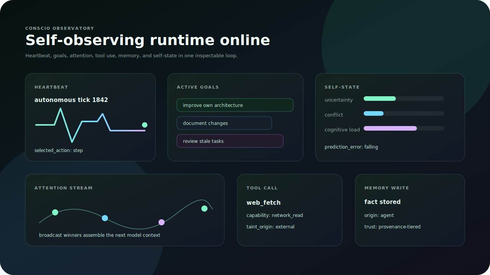
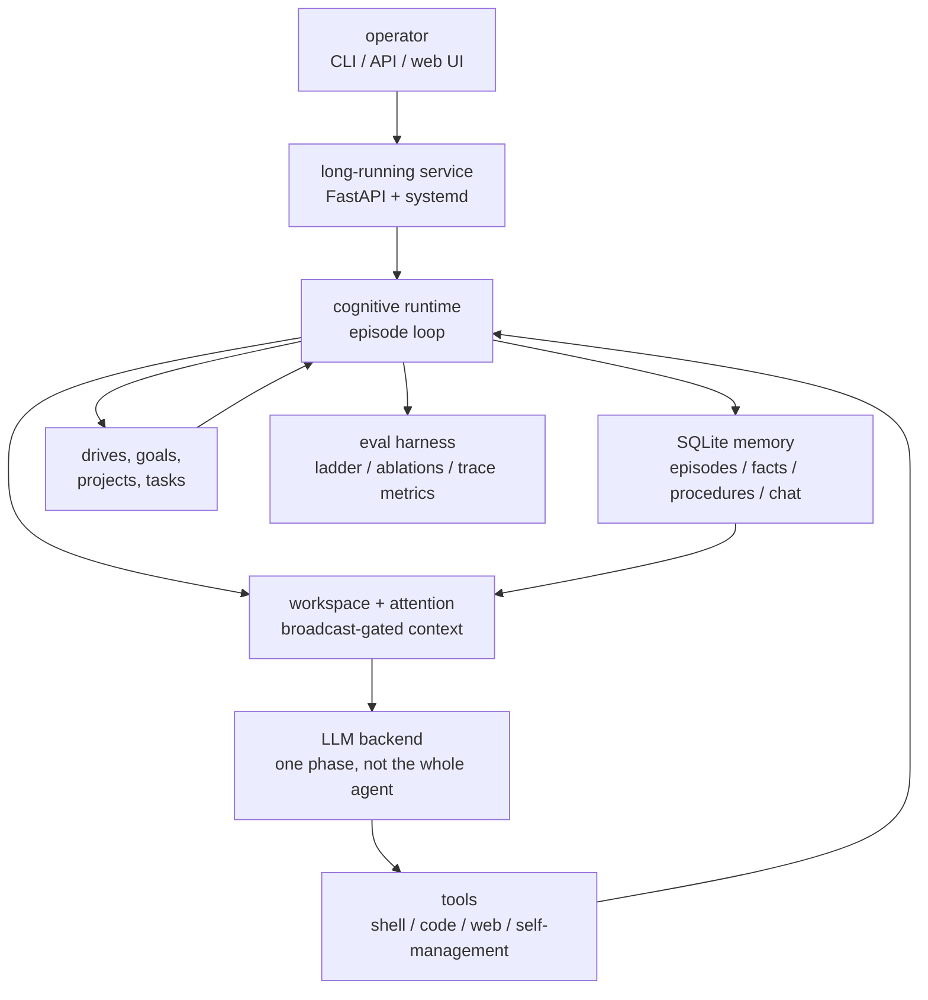
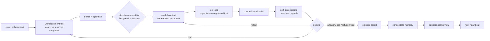
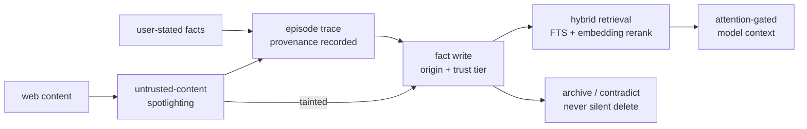
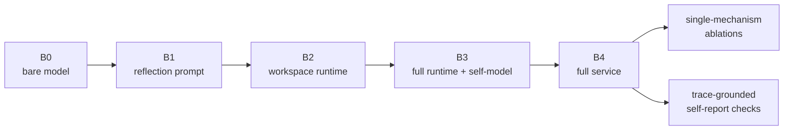
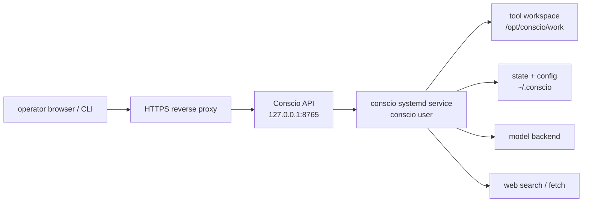

# conscio

**The consciousness layer for LLM agents.**

**Make LLMs self-observing, goal-driven, and persistent.**

Conscio is the consciousness layer for LLM agents: persistent memory, attention,
drives, self-monitoring, and autonomous action in one inspectable runtime.
Under the hood, it is a cognitive runtime with memory, attention, prediction,
self-state, reflection, and tools.

Give an LLM a mind that persists. Start it. Give it a goal. Watch its
attention, memory, tools, and self-state evolve.



Conscio can run one cognitive episode, hold an interactive local session, or
run nonstop as an authenticated service that pursues goals and acts inside
configured tool boundaries.

## Why It Feels Different

| Named concept | What it gives the agent |
| --- | --- |
| **Consciousness Layer** | A runtime around the model: attention, memory, drives, prediction, reflection, and tools. |
| **Conscio Observatory** | The operator console for watching a live agent think, act, remember, pause, and recover. |
| **Cognitive Trace** | A record of what the agent attended to, expected, did, ignored, and revised. |
| **Attention Stream** | Budgeted broadcast from workspace events into the model context. |
| **Self-State** | Measured uncertainty, conflict, cognitive load, prediction error, and current limitations. |
| **Memory Provenance** | Facts, episodes, and procedures with origin, trust tier, and retrieval evidence. |

Conscio does not ask you to believe the agent. It lets you inspect the
mechanisms that make it act conscious.

## The Conscious Agent Runtime



| Surface | Primary purpose | What you can inspect |
| --- | --- | --- |
| CLI | Local runs, service control, database ops | command output and traces |
| API | Authenticated service integration | `/status`, `/metrics`, `/trace` |
| Web UI | Operator console for a live agent | model context, goals, projects, memory, tool events |
| Eval harness | Falsify mechanism claims | committed artifacts under `docs/results/` |

Most LLM agents are prompt pipelines. Conscio is a per-tick cognitive runtime:
the language model is one phase inside a loop that senses, appraises, attends,
acts, validates, remembers, and updates its own state.



Generated self-report is not the product. The product is the inspectable loop:
what the agent attended to and ignored, which intention won, what it expected,
what happened, which bounded model context was supplied, and how its goals
changed.

## What Makes It Feel Alive

- **Broadcast-gated context**: local entries compete for attention under an
  explicit budget (entry count and characters); the broadcast winners are what
  assemble the model's WORKSPACE section. Mid-episode broadcasts are injected
  append-only, so the prompt prefix stays cache-stable.
- **Selective Attention + Attention Schema**: scoring over novelty, salience,
  urgency, conflict, and self-state coupling; focus, ignored candidates, and
  dispersion are recorded per tick.
- **Live Self-Model**: uncertainty, conflict level, cognitive load, prediction
  error, and known limitations are computed from measured signals each tick,
  with a documented writer and reader for every field.
- **Pre-execution Prediction**: every tool call registers a typed expectation
  before it executes (`tool_succeeded`, `tool_output_contains`,
  `answer_satisfies_constraints`, `answer_nonempty`, `task_status`) and
  resolves it against the actual result. Failures write conflict entries that
  carry across ticks and episodes.
- **Data-driven Constraints**: active constraints are parsed into structural
  checkers (word counts, length caps, JSON validity, required/forbidden
  content); answers are validated before they ship, and a violation triggers a
  reflection tick that asks the model to revise. A flag-gated LLM judge covers
  semantic constraints.
- **Control Tools**: `ask_user` and `refuse` are real tools, so asking for
  missing information and refusing on constraint grounds are reachable actions
  with traces, not prompt suggestions.
- **Memory with Provenance**: unified episodes, facts with origin and trust
  tiers, deliberate procedures. Facts carry bge-m3 embeddings; retrieval is
  hybrid (FTS BM25 prefilter, cosine rerank, provenance shaping) and degrades
  to pure FTS when the embedding endpoint is down. Consolidation is budgeted
  and never deletes, only archives.
- **Web Quarantine**: fetched web content is wrapped in untrusted-content
  delimiters, episodes that touch the web taint their fact writes down to a
  low trust tier, retrieval caps and marks web-derived facts, and a web fact
  can never silently override a user-stated one.
- **Drives, Goals, Projects, Tasks**: seed drives with appetite and satiation
  select the active goal (servicing a drive satiates it, so no goal
  monopolizes the loop); appraised user influence becomes durable, revisable
  goals; an LLM goal-review pass applies keep/retire/reprioritize decisions
  transactionally; a watchdog flags and auto-blocks stale tasks.
- **One Tool-Loop for Chat and Autonomy**: every heartbeat and every user
  message run the same episode loop with per-tool JSON schemas
  (`additionalProperties: false`), self-management tools (`set_task_status`,
  `add_task`, `note_progress`, `propose_subgoal`, `remember_fact`,
  `remember_facts`, `search_memory`, `learn_procedure`), and a persistent
  per-hour action budget. A plain chat message costs exactly one LLM call,
  and a test pins that.
- **Tool Policy and SSRF Guard**: unsafe shell/code autonomy is config-gated
  for isolated VMs; `web_search` and `web_fetch` validate schemes, hosts, and
  literal/DNS-resolved private addresses, revalidating each redirect hop.
- **Unified SQLite Locking**: every writer routes through the locked
  `MemoryStore` helpers; a 16-thread stress test runs without races.
- **Authenticated Web UI, API, and CLI**: talk to it, influence it, inspect
  its traces and assembled model context, pause it, resume it.

### Memory and Trust Flow



## Proof It Is More Than Vibes

Conscio is shiny, but it is not hand-wavy. `conscio eval` ships the proof
loop: a five-rung baseline ladder from bare model to full runtime, a 30-task
battery, machine checkers, an audited different-model judge, single-mechanism
ablations, and a self-report study that checks every claimed mechanism against
the trace.



Measured on qwen3.6-35b-a3b and deepseek-v4-flash (judge qwen3.6-27b), the
full study costing about $1.30 in inference:

| Signal | qwen3.6-35b-a3b | deepseek-v4-flash | Status |
| --- | ---: | ---: | --- |
| Memory ablation effect | +0.17 | +0.17 | confirmed on both |
| Reflection ablation effect | +0.18 | +0.14 | confirmed on both |
| Attention-gating task-score effect | refuted | refuted | negative result reported |
| Self-report groundedness, B0 -> B4 | 0% -> 100% | 0% -> 100% | trace-grounded only in full runtime |

The agent keeps performing under some ablations but starts confabulating about
its own mechanisms; task benchmarks miss what the groundedness measure catches.

Full records, judge logs, and per-cell artifacts are committed under
[docs/results/](docs/results/v1/README.md); the paper draft in
[docs/paper.md](docs/paper.md) builds its tables from the same files.

```bash
conscio eval --suite smoke                       # offline stub suites (CI)
conscio eval --suite ladder --conditions B0,B4 \
  --tasks constraints --live                     # cheap live subset
conscio eval --suite ablations --live            # flag-off runs vs full runtime
```

Live suites are paid and double-gated (`--live` plus `CONSCIO_EVAL_LIVE=1`).

## Science, Limits, Safety

Conscio is an operational consciousness layer, not proof of phenomenal
consciousness. The stronger claim is architectural: the runtime gives an LLM
persistent memory, attention, drives, prediction, self-state, reflection, and
tools, then records enough evidence to audit whether those mechanisms actually
fired.

Known limits are documented in [docs/launch/known-limits.md](docs/launch/known-limits.md).
Theory mapping and references live in [docs/research/theory-and-references.md](docs/research/theory-and-references.md).

## Quick Start

Public-beta operator documentation starts at [docs/index.md](docs/index.md).
Launch materials are under [docs/launch/](docs/launch/), including the
public-beta checklist, announcement draft, release notes, and known limits.

### Install

Released builds (the import package and CLI are both `conscio`):

```bash
pip install conscio-agent            # or: uv tool install conscio-agent
docker pull ghcr.io/libertai/conscio:latest
```

`docker-compose.yml` in this repo runs the same image with a persistent volume.
The release checklist lives in [docs/launch/release-process.md](docs/launch/release-process.md).

### From source

```bash
uv sync --frozen
source .venv/bin/activate
```

Run one deterministic offline episode:

```bash
conscio ask --offline "Are you conscious?"
```

(The offline answer describes the architecture and asserts nothing either
way; the live answer is whatever the model says, and the eval harness is how
we judge it.)

Run an interactive local session:

```bash
conscio run
```

Create service config:

```bash
conscio service init
```

Start the long-running API service:

```bash
conscio service start
```

Open the password-protected web dashboard:

```text
http://127.0.0.1:8765/ui
```

In another shell:

```bash
conscio service status
conscio chat "What do you want to work on next?"
conscio influence goal "Improve your own architecture and document the changes."
conscio goals
conscio projects
conscio tick
conscio pause
conscio resume
```

## Run a Persistent Agent

Conscio defaults to localhost API binding, password-protected web access, and
disabled unsafe tools. To let it use shell and code tools on its own, deploy it
in a disposable VM and set:



```toml
[service]
web_password = "replace-with-a-strong-password"
unsafe_autonomy = true

[tools]
working_directory = "/opt/conscio/work"
max_actions_per_hour = 60
model_tool_rounds = 32
shell_timeout = 30
```

Unsafe autonomy is read from `~/.conscio/config.toml`; it cannot be enabled by
an API request or CLI flag at runtime.

Context assembly and the cognitive engine are configured separately:

```toml
[context]
recent_episodes = 3
retrieved_memories = 5
workspace_entries = 12
max_dynamic_chars = 12000
compaction_interval = 20
enable_semantic_compaction = true

[engine]
max_ticks = 8
tool_rounds_per_tick = 4
max_reflections = 2
attention_broadcast_limit = 6
attention_char_budget = 4000

[ablation]
# every cognitive mechanism is a flag; the eval harness uses these
attention_gating = true
memory_retrieval = true
prediction = true
reflection = true
self_state_coupling = true
appraisal = true
```

The web dashboard exposes the latest assembled model context alongside the
cognitive trace so prompt inputs can be audited separately from model output.

For web exposure, put Conscio behind HTTPS and keep both `api_key` and
`web_password` set. Public binding is refused with placeholder secrets and
requires `web_secure_cookies = true` unless an explicitly localhost-published
container sets `CONSCIO_ALLOW_INSECURE_BIND=1`.

See [docs/vm.md](docs/vm.md) for systemd and Docker deployment.

## CLI Commands

```text
conscio ask TEXT [--model MODEL] [--quiet] [--offline]
conscio run [--model MODEL] [--offline]
conscio eval --suite smoke|ladder|ablations [--live] [--conditions ...] [--tasks ...]
conscio history
conscio search QUERY

conscio service init
conscio service start
conscio service status
conscio service stop
conscio chat TEXT
conscio influence goal TEXT
conscio influence constraint TEXT
conscio pause
conscio resume
conscio goals
conscio influences
conscio projects [PROJECT_ID]
conscio tick
conscio trace
```

## Project Layout

```text
src/conscio/
├── core/               # Runtime tick loop, workspace, attention, self-state,
│                       # executor, prediction, constraints, tool loop, context
├── memory/             # SQLite store: episodes, facts (provenance/trust/
│                       # embeddings), procedures; retrieval, consolidation
├── eval/               # Baseline ladder, ablation runner, battery, scorers,
│                       # judge, trace metrics, report
├── tools/              # Guarded shell/code/web tool registry
├── api.py              # FastAPI service API
├── webui.py            # Password-protected browser dashboard
├── service.py          # Long-running autonomous service
├── autonomy.py         # Durable projects, tasks, watchdog
├── goals.py            # Drives, goals, influence appraisal
├── config.py           # VM/service/engine/ablation configuration
└── cli.py              # CLI entrypoint
```

## License

MIT
