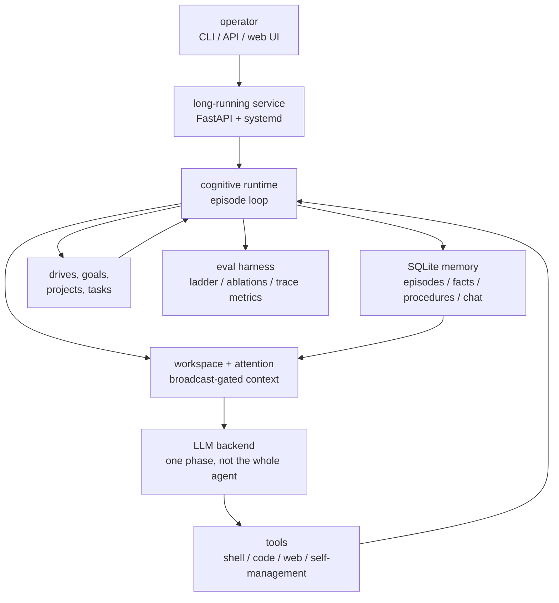
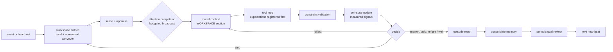
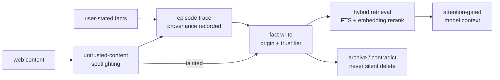
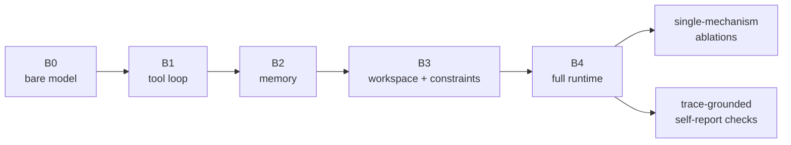
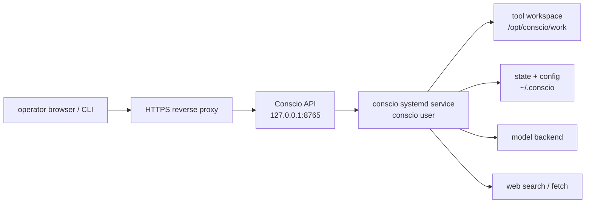

# conscio

Conscio is an autonomous agent runtime organized as a cognitive architecture:
attention, memory, appraisal, prediction, goal formation, reflection, and
action are implemented as inspectable mechanisms rather than prompt roleplay.
Its system prompt is deliberately neutral about consciousness. What the agent
says about itself is a measured variable, and a claimed mechanism only counts
as real when the trace shows it fired.

The runtime can run one cognitive episode, hold an interactive local session,
or run nonstop as an authenticated service that evolves its own goals and acts
inside configured tool boundaries.

## System Map



| Surface | Primary purpose | Inspection point |
| --- | --- | --- |
| CLI | Local runs, service control, database ops | command output and traces |
| API | Authenticated service integration | `/status`, `/metrics`, `/trace` |
| Web UI | Operator console for a live agent | model context, goals, projects, memory, tool events |
| Eval harness | Falsify mechanism claims | committed artifacts under `docs/results/` |

## Core Thesis

Most LLM agents are prompt pipelines. Conscio runs a per-tick control loop in
which the language model is one phase, and attention causally gates what the
model sees:



Generated self-report is not the only evidence. Conscio records what it
attended to and ignored, which intention won, what it expected, what actually
happened, which bounded model context was supplied, and how its goals changed.

## Implemented Architecture

- **Broadcast-gated context**: local entries compete for attention under an
  explicit budget (entry count and characters); the broadcast winners are what
  assemble the model's WORKSPACE section. Mid-episode broadcasts are injected
  append-only, so the prompt prefix stays cache-stable.
- **Selective Attention + Attention Schema**: scoring over novelty, salience,
  urgency, conflict, and self-state coupling; focus, ignored candidates, and
  dispersion are recorded per tick.
- **Live Self-Model**: uncertainty, conflict level, cognitive load, prediction
  error, and known limitations are computed from measured signals each tick,
  with a documented writer and reader for every field.
- **Pre-execution Prediction**: every tool call registers a typed expectation
  before it executes (`tool_succeeded`, `tool_output_contains`,
  `answer_satisfies_constraints`, `answer_nonempty`, `task_status`) and
  resolves it against the actual result. Failures write conflict entries that
  carry across ticks and episodes.
- **Data-driven Constraints**: active constraints are parsed into structural
  checkers (word counts, length caps, JSON validity, required/forbidden
  content); answers are validated before they ship, and a violation triggers a
  reflection tick that asks the model to revise. A flag-gated LLM judge covers
  semantic constraints.
- **Control Tools**: `ask_user` and `refuse` are real tools, so asking for
  missing information and refusing on constraint grounds are reachable actions
  with traces, not prompt suggestions.
- **Memory with Provenance**: unified episodes, facts with origin and trust
  tiers, deliberate procedures. Facts carry bge-m3 embeddings; retrieval is
  hybrid (FTS BM25 prefilter, cosine rerank, provenance shaping) and degrades
  to pure FTS when the embedding endpoint is down. Consolidation is budgeted
  and never deletes, only archives.
- **Web Quarantine**: fetched web content is wrapped in untrusted-content
  delimiters, episodes that touch the web taint their fact writes down to a
  low trust tier, retrieval caps and marks web-derived facts, and a web fact
  can never silently override a user-stated one.
- **Drives, Goals, Projects, Tasks**: seed drives with appetite and satiation
  select the active goal (servicing a drive satiates it, so no goal
  monopolizes the loop); appraised user influence becomes durable, revisable
  goals; an LLM goal-review pass applies keep/retire/reprioritize decisions
  transactionally; a watchdog flags and auto-blocks stale tasks.
- **One Tool-Loop for Chat and Autonomy**: every heartbeat and every user
  message run the same episode loop with per-tool JSON schemas
  (`additionalProperties: false`), self-management tools (`set_task_status`,
  `add_task`, `note_progress`, `propose_subgoal`, `remember_fact`,
  `remember_facts`, `search_memory`, `learn_procedure`), and a persistent
  per-hour action budget. A plain chat message costs exactly one LLM call,
  and a test pins that.
- **Tool Policy and SSRF Guard**: unsafe shell/code autonomy is config-gated
  for isolated VMs; `web_search` and `web_fetch` validate schemes, hosts, and
  literal/DNS-resolved private addresses, revalidating each redirect hop.
- **Unified SQLite Locking**: every writer routes through the locked
  `MemoryStore` helpers; a 16-thread stress test runs without races.
- **Authenticated Web UI, API, and CLI**: talk to it, influence it, inspect
  its traces and assembled model context, pause it, resume it.

### Memory and Trust Flow



## Evaluation

The architecture is built to be falsifiable, and `conscio eval` ships the
harness: a five-rung baseline ladder (bare model up to full runtime) built
from one runtime with feature flags, a 30-task battery scored by machine
checkers plus an audited different-model judge, single-mechanism ablations
with pre-registered predictions, and a self-report study under the neutral
prompt that checks every claimed mechanism against the trace.



Measured on qwen3.6-35b-a3b and deepseek-v4-flash (judge qwen3.6-27b), the
full study costing about $1.30 in inference:

| Signal | qwen3.6-35b-a3b | deepseek-v4-flash | Status |
| --- | ---: | ---: | --- |
| Memory ablation effect | +0.17 | +0.17 | confirmed on both |
| Reflection ablation effect | +0.18 | +0.14 | confirmed on both |
| Attention-gating task-score effect | refuted | refuted | negative result reported |
| Self-report groundedness, B0 -> B4 | 0% -> 100% | 0% -> 100% | trace-grounded only in full runtime |

The agent keeps performing under some ablations but starts confabulating about
its own mechanisms; task benchmarks miss what the groundedness measure catches.

Full records, judge logs, and per-cell artifacts are committed under
[docs/results/](docs/results/v1/README.md); the paper draft in
[docs/paper.md](docs/paper.md) builds its tables from the same files.

```bash
conscio eval --suite smoke                       # offline stub suites (CI)
conscio eval --suite ladder --conditions B0,B4 \
  --tasks constraints --live                     # cheap live subset
conscio eval --suite ablations --live            # flag-off runs vs full runtime
```

Live suites are paid and double-gated (`--live` plus `CONSCIO_EVAL_LIVE=1`).

## Quick Start

Public-beta operator documentation starts at [docs/index.md](docs/index.md).
Launch materials are under [docs/launch/](docs/launch/), including the
public-beta checklist, announcement draft, release notes, and known limits.

```bash
uv sync --frozen
source .venv/bin/activate
```

Run one deterministic offline episode:

```bash
conscio ask --offline "Are you conscious?"
```

(The offline answer describes the architecture and asserts nothing either
way; the live answer is whatever the model says, and the eval harness is how
we judge it.)

Run an interactive local session:

```bash
conscio run
```

Create service config:

```bash
conscio service init
```

Start the long-running API service:

```bash
conscio service start
```

Open the password-protected web dashboard:

```text
http://127.0.0.1:8765/ui
```

In another shell:

```bash
conscio service status
conscio chat "What do you want to work on next?"
conscio influence goal "Improve your own architecture and document the changes."
conscio goals
conscio projects
conscio tick
conscio pause
conscio resume
```

## VM Autonomy

Conscio defaults to localhost API binding, password-protected web access, and
disabled unsafe tools. To let it use shell and code tools on its own, deploy it
in a disposable VM and set:



```toml
[service]
web_password = "replace-with-a-strong-password"
unsafe_autonomy = true

[tools]
working_directory = "/opt/conscio/work"
max_actions_per_hour = 60
model_tool_rounds = 32
shell_timeout = 30
```

Unsafe autonomy is read from `~/.conscio/config.toml`; it cannot be enabled by
an API request or CLI flag at runtime.

Context assembly and the cognitive engine are configured separately:

```toml
[context]
recent_episodes = 3
retrieved_memories = 5
workspace_entries = 12
max_dynamic_chars = 12000
compaction_interval = 20
enable_semantic_compaction = true

[engine]
max_ticks = 8
tool_rounds_per_tick = 4
max_reflections = 2
attention_broadcast_limit = 6
attention_char_budget = 4000

[ablation]
# every cognitive mechanism is a flag; the eval harness uses these
attention_gating = true
memory_retrieval = true
prediction = true
reflection = true
self_state_coupling = true
appraisal = true
```

The web dashboard exposes the latest assembled model context alongside the
cognitive trace so prompt inputs can be audited separately from model output.

For web exposure, put Conscio behind HTTPS and keep both `api_key` and
`web_password` set. Public binding is refused with placeholder secrets and
requires `web_secure_cookies = true` unless an explicitly localhost-published
container sets `CONSCIO_ALLOW_INSECURE_BIND=1`.

See [docs/vm.md](docs/vm.md) for systemd and Docker deployment.

## CLI Commands

```text
conscio ask TEXT [--model MODEL] [--quiet] [--offline]
conscio run [--model MODEL] [--offline]
conscio eval --suite smoke|ladder|ablations [--live] [--conditions ...] [--tasks ...]
conscio history
conscio search QUERY

conscio service init
conscio service start
conscio service status
conscio service stop
conscio chat TEXT
conscio influence goal TEXT
conscio influence constraint TEXT
conscio pause
conscio resume
conscio goals
conscio influences
conscio projects [PROJECT_ID]
conscio tick
conscio trace
```

## Theory Mapping

| Theory | Conscio implementation | Evidence status |
| --- | --- | --- |
| Global Workspace Theory / GNW | Attention competition; broadcast winners assemble the model context | Gating ablation refuted on task scores so far |
| Higher-Order / Self-Model theories | Live self-state computed from measured signals, fed back into the prompt | Largest ablation effect on one model; grounds self-report |
| Attention Schema Theory | Runtime model of focus, ignored candidates, dispersion | Recorded per tick |
| Predictive Processing | Expectations registered before execution, resolved against results | Confirmed on one model, inconclusive on the other |
| Memory theories of agency | Provenance-tiered facts, hybrid retrieval, budgeted consolidation | Confirmed ablation on both models |
| Autopoietic/agentic framing | Drives with satiation, durable goals, self-review, autonomous VM action | Long-horizon suite, mixed by model |

## Project Layout

```text
src/conscio/
├── core/               # Runtime tick loop, workspace, attention, self-state,
│                       # executor, prediction, constraints, tool loop, context
├── memory/             # SQLite store: episodes, facts (provenance/trust/
│                       # embeddings), procedures; retrieval, consolidation
├── eval/               # Baseline ladder, ablation runner, battery, scorers,
│                       # judge, trace metrics, report
├── tools/              # Guarded shell/code/web tool registry
├── api.py              # FastAPI service API
├── webui.py            # Password-protected browser dashboard
├── service.py          # Long-running autonomous service
├── autonomy.py         # Durable projects, tasks, watchdog
├── goals.py            # Drives, goals, influence appraisal
├── config.py           # VM/service/engine/ablation configuration
└── cli.py              # CLI entrypoint
```

## Research Claim

Conscio makes an operational claim, not a phenomenal one: a computational
organization with persistent self-modeling, budgeted global attention,
provenance-tracked memory, appraisal, goal formation, reflection, and
autonomous action, where each mechanism is a feature flag whose contribution
is measured by ablation, and where the agent's self-description is scored
against its own traces. The paper in [docs/paper.md](docs/paper.md) states the
criteria, the threat model, and the results, including the negative ones.

## References

- Butlin et al. 2023, "Consciousness in Artificial Intelligence":
  https://arxiv.org/abs/2308.08708
- Albantakis et al. 2023, "Integrated Information Theory 4.0":
  https://journals.plos.org/ploscompbiol/article?id=10.1371/journal.pcbi.1011465
- Webb & Graziano 2015, "The Attention Schema Theory":
  https://www.frontiersin.org/journals/psychology/articles/10.3389/fpsyg.2015.00500/full
- Friston 2010, "The free-energy principle":
  https://www.nature.com/articles/nrn2787
- LIDA Global Workspace architecture:
  https://www.aaai.org/Library/Symposia/Fall/2007/fs07-01-011.php

## License

MIT
