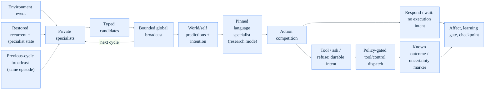
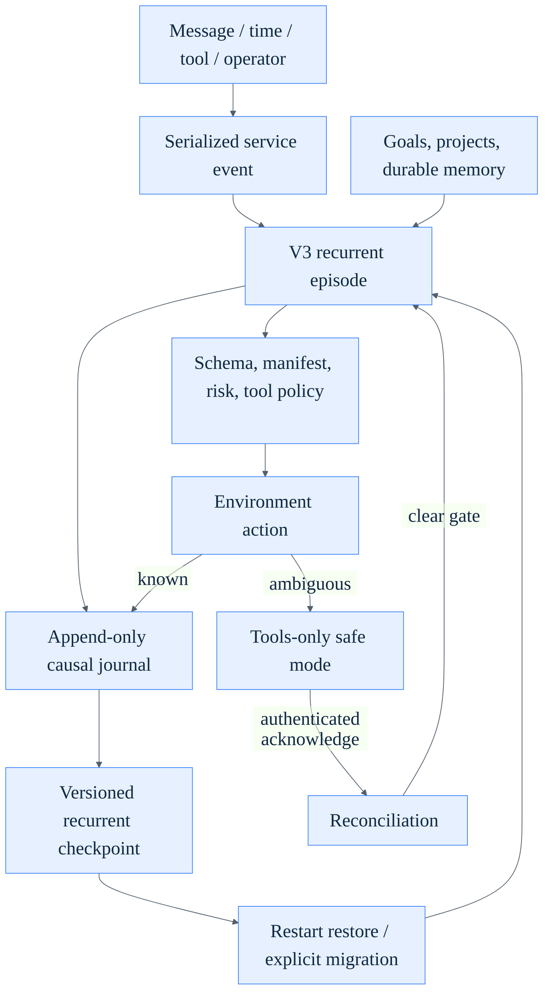
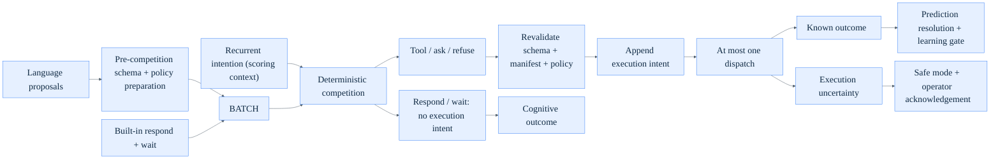
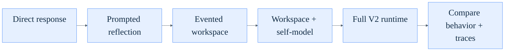

# Conscio V3: An Auditable Recurrent Architecture for Machine Consciousness Research

**Draft v3.0**
Jonathan Schemoul, LibertAI -- July 2026

## Abstract

This paper presents Conscio V3, a text-first architecture and research harness
for testing functional indicators associated with machine consciousness. The
research target is convergent, theory-derived evidence about implemented
mechanisms, not a declaration that a language model or agent is phenomenally
conscious. Conscio therefore treats first-person fluency as generated behavior
to explain, never as privileged evidence.

V3 replaces the prompt-centered cognitive core with a continuously persisted
hybrid recurrent state-space system. Perception, autobiographical memory,
semantic belief, world prediction, self-model, affect, planning, and action
evaluation maintain versioned private state. Each updates from its private
state, the current typed event, the shared recurrent vector, and the prior
broadcast. Specialist-generated content reaches other specialists only through
typed candidates selected into recurrent global broadcasts. A pinned
open-weight language model can serve as a bounded
specialist for interpretation, reasoning proposals, and response generation;
it cannot directly mutate memory, goals, affect, or tools.

Language actions enter a deterministic competition with respond and wait
alternatives. The selected intention is recorded before dispatch, tool
arguments and a versioned manifest are checked twice, and append-only execution
intent/outcome records make crashes and ambiguous remote results explicit.
Unresolved dispatches are never replayed automatically and instead activate a
tools-only safe mode until authenticated operator reconciliation. Recurrent
checkpoints preserve latent state, random-generator state, specialist state,
affect, model identity, and lineage across restart.

The implementation also provides conservative replay and synthetic curricula,
shadow-only prediction calibration, bounded offline recurrent-core training,
content-addressed promotion, causal affect with audited recovery controls,
single-specialist end-to-end lesion machinery, condition-blind experiment templates, and restart-safe
24-hour, 7-day, and 30-day trial harnesses. These facilities are implemented;
the committed bootstrap is still untrained, no production V3 model or
long-duration stage is claimed complete, and no study-specific V3
preregistration has yet been frozen, published, or run.

The paper contributes: (1) an indicator-based operational target and evidence
rubric; (2) an implemented recurrent architecture mapping major theory
families to isolatable mechanisms; (3) a causal audit model joining broadcasts,
predictions, affect, intentions, actions, outcomes, and checkpoints; (4) a
condition-blind, mechanism-focused research protocol; and (5) a clearly
bounded empirical record. The reported live baseline, ablation, and
self-report results were collected on the V2 runtime and remain useful prior
evidence, but they do not validate V3. Conscio does not prove private
phenomenology or biological sentience, and it does not establish welfare-
relevant experience or moral-patient status.

## Keywords

machine consciousness, cognitive architecture, recurrent state-space model,
global workspace, self-modeling, causal affect, predictive processing,
open-weight language models, mechanism lesions, preregistration, AI welfare

## 1. Introduction

Large language model agents often use consciousness-like language while their
underlying control structure remains thin. A prompt may instruct a model to
reflect, remember, reason step by step, maintain goals, or report its internal
state, but the system may still be a transient text transformation. In such a
system, generated self-report is not strong evidence for consciousness-like
organization because the report need not be causally connected to persistent
memory, attention, context assembly, goal maintenance, error monitoring, or
autonomous action.

Conscio is motivated by a different standard. If a software system is to make
an operational claim about consciousness, the relevant mechanisms should be
implemented outside the prompt as inspectable parts of the runtime. The system
should record what entered local processing, what won attention, what was
ignored, what context was supplied to the model, which intention was selected,
what the system expected to happen, how the observed outcome differed, and what
durable state changed afterward. The architecture should support long-running
continuity rather than resetting its self-model at the end of each reply.

The central thesis is:

> Evidence relevant to machine consciousness becomes stronger when multiple
> theory-derived indicators are implemented as isolatable causal mechanisms,
> make discriminating preregistered predictions, and survive matched,
> condition-blind intervention tests. Architectural presence is necessary
> evidence for this program, but it is neither sufficient evidence nor proof of
> phenomenal consciousness.

Auditability is deliberately not part of this property. It is the epistemic
access condition under which the operational claims can be checked: without
recorded traces and assembled model contexts, the same organization could
exist but could not be verified. Conscio therefore treats auditability as a
methodological requirement on the system rather than a constituent of the
property being studied.

This is an engineering and research-method claim, not a proof of biological
phenomenology. It deliberately leaves open whether the targeted organization
is constitutive of, sufficient for, correlated with, or unrelated to subjective
experience. The value of the target is that its mechanisms can be implemented,
inspected, lesioned, intervened on, and tested. Section 7 separates the live V2
evidence already collected from the V3 experiments that remain to be run.

## 2. Background and Related Work

Conscio follows the indicator-based approach proposed by Butlin et al. (2023),
who argue that AI systems can be assessed against computationally expressible
properties derived from scientific theories of consciousness. Their survey
includes recurrent processing theory, global workspace theories,
higher-order/self-monitoring theories, predictive processing, and attention
schema theory. Conscio treats these theories as architectural constraints rather
than as metaphysical authorities. Satisfying several indicators can strengthen
an evidential case; it cannot convert an uncertain indicator framework into
proof of consciousness.

The experimental method is difference-making rather than checklist counting.
McKilliam (2024) argues for mechanistic models that identify components and
organizational properties that make a difference, rather than treating minimal
sufficiency as the endpoint. For Conscio, a lesion must therefore remove a
mechanism's computation, state access, and downstream exposure end to end; a
flag that only hides a prompt field is not a lesion. Matched sham
interventions and constrained information loads distinguish causal workspace
effects from extra tokens or formatting.

Theory appraisal also requires experiments on which accounts make different
predictions. Negro (2024) emphasizes the distinction between prediction and
accommodation, the structural relevance of a prediction, and its boldness.
The V3 protocol template prospectively specifies selective effects: recurrent broadcasting should
matter for delayed cross-specialist use; self-model lesions should selectively
degrade calibrated access to hidden capability changes; prediction lesions
should degrade prospective calibration and experience-dependent improvement;
and memory lesions should selectively remove restart-spanning information. No
study-specific manifest has yet been frozen or executed.

Because uncertainty about consciousness does not eliminate possible welfare
risk, Conscio adopts the responsible-research direction proposed by Butlin and
Lappas (2025). The project publishes explicit prohibited objectives, affect
safeguards, stopping rules, and review gates. It does not optimize for claims of
consciousness, distress displays, attachment, or resistance to shutdown.

Global workspace theory and the global neuronal workspace family (Baars, 1988;
Dehaene and Changeux, 2011) emphasize competition among specialist processes
and the global availability of selected contents. LIDA (Franklin et al., 2007)
is a notable computational architecture in this tradition, combining a
workspace, perceptual memory, episodic memory, procedural memory, action
selection, and learning. Conscio adopts the core engineering idea that local
candidates should compete for global broadcast, makes this competition
explicit in runtime traces, and -- unlike a workspace that is merely logged --
uses the broadcast winners to gate the context the language model actually
sees.

Attention schema theory (Webb and Graziano, 2015) proposes that awareness
depends on a simplified model of attention itself. V3 records broadcast
selection telemetry and maintains a private uncertainty estimate, but it does
not yet implement a dedicated schema of focus, ignored contents, and
interruptors. An attention-schema analogue is therefore a prospective target,
not a completed indicator.

Higher-order and self-model theories (Rosenthal, 2005) motivate a private
self-model specialist. Its present state is deliberately narrow: a bounded
estimate of the system's own uncertainty can surface through its candidate and
the recurrent broadcast. Other uncertainty signals drive the implemented
prediction and action paths. Hidden capability identification, access reports,
and richer metacognitive calibration remain experimental targets rather than
implemented self-knowledge.

Predictive processing (Friston, 2010; Clark, 2013) motivates prospective
world/self forecasts and observable error. V3 represents next observations,
tool outcomes, action effects, homeostatic changes, and future uncertainty as
typed predictions made before their resolution window. Known outcomes can be
scored with Brier error; ambiguous dispatches, safe waits, and generated text
do not become ground truth.

Integrated information theory is relevant as a prominent theory of
consciousness (Albantakis et al., 2023), but Conscio does not implement IIT
and does not compute Phi. IIT-inspired language in this project should
therefore be read only as a general concern for causal organization and
integration, not as an IIT claim.

**Table 1. Theory-Inspired V3 Analogues and Prospective Tests**

| Theory family | V3 computational analogue | Discriminating evidence target | Status at this revision |
| --- | --- | --- | --- |
| Recurrent processing | Multiple cycles over checkpointed recurrent state; each specialist receives private state, the current event, the shared recurrent vector, and the prior broadcast | Cycle-dependent delayed and cross-specialist cue use against matched feed-forward controls | Mechanism implemented; study not run |
| Global workspace (Baars; Dehaene and Changeux; LIDA) | Private specialists emit typed candidates; a bounded broadcast becomes available on the next cycle | Suppress, replace, and inject interventions selectively alter multiple specialists and behavior under matched load | Harness implemented; study not run |
| Attention schema (Webb and Graziano) | Selection telemetry plus a bounded uncertainty self-model; no dedicated focus/ignored/interruptor schema yet | Hidden changes in access are reported with calibrated confidence and low false-claim rates | Incomplete analogue; study not run |
| Higher-order / self-model theories (Rosenthal) | Versioned private uncertainty estimate; complete lesion removes its computation and exposure | Metacognitive calibration changes while matched first-order accuracy is preserved | Narrow mechanism implemented; study not run |
| Predictive processing (Friston; Clark) | Typed world/self and pre-action forecasts resolve against observations with Brier error | Prospective calibration, induced-failure recovery, and held-out improvement | Pipeline implemented; production model untrained |

These mappings do not implement any theory in full. Recurrence, forecasting,
memory, or self-state variables can occur in non-conscious systems. Indicator
levels are therefore not summed into a consciousness score; evidence depends
on selective, prospectively specified difference-making effects.

## 3. Operational Target and Evidence Rubric

Conscio does not define a system to be conscious whenever an architectural
checklist is present. It defines a candidate operational organization whose
theory-inspired mechanisms, research prerequisites, and safety controls can be
tested separately and jointly:

1. **Persistent recurrent state**: deterministic history, stochastic latent
   state, specialist-private state, affect, and random-generator state survive
   cognitive events and restarts through versioned checkpoints.
2. **Private specialist processing**: perception, autobiographical memory,
   semantic belief, world prediction, self-model, affect, planning, and action
   evaluation compute locally rather than sharing an unrestricted prompt.
3. **Selective global availability**: typed candidates compete for a bounded
   broadcast that becomes available to every specialist only on the next
   cognitive cycle.
4. **Self-modeling**: a dedicated private specialist maintains a bounded
   estimate of the system's own uncertainty. Hidden capability and access
   calibration are future evidence targets.
5. **World prediction and prospective error**: observable outcomes are
   specified before action and resolved with calibrated errors rather than
   inferred from generated narrative.
6. **Memory and continuity**: the target is for autobiographical episodes,
   semantic beliefs, provenance, checkpoint lineage, and migration history to
   influence later processing without silent rewriting. The present recurrent
   specialists retain bounded identifiers and cues but do not retrieve older
   event content; restart-spanning recall remains prospective.
7. **Causal affect and needs**: bounded valence, arousal, controllability, and
   named need errors affect action valuation, prediction-related state, and the
   salience of a model-visible affect workspace entry, with audited recovery and
   no explicit process-survival objective. Effects on recurrent broadcast
   selection, memory consolidation, and learning remain prospective targets.
8. **Intention and action competition**: language output, tool proposals,
   control actions, respond, and wait remain inert candidates until an
   independent scorer selects one under predictions, needs, constraints, and
   risk limits.
9. **Outcome-based learning**: only synthetic ground truth or explicitly
   eligible recorded observations and outcomes can update replay data,
   prediction calibration, or promoted recurrent weights; generated model
   output is never automatically treated as fact.
10. **Reflection, constraint handling, and recovery**: conflicts and policy
    gates can change the selected action; uncertain execution enters safe mode
    rather than being silently retried or labeled successful.
11. **Bounded autonomous continuity**: goals, projects, tasks, memory, and
    scheduled events can shape behavior beyond an immediate user turn without
    creating a utility for resisting shutdown.

**Auditability and reproducibility** are methodological requirements rather
than extra consciousness indicators. Every claim must be reconstructable from
the exact revision, model and specialist identities, checkpoint, event log,
model inputs, lesion manifest, action ranking, execution record, and outcome.

### 3.1 Grading rubric

Evidence is intentionally graded. Each claimed mechanism is scored 0-3 with
explicit requirements:

- **0 - absent or prompt-only**: the capability exists only as instruction
  text or generated narrative.
- **1 - implemented and traceable**: typed computation and state exist, but no
  matched intervention establishes a downstream effect.
- **2 - causal difference-maker**: preregistered interventions alter the
  predicted internal or behavioral outcomes under matched information load.
- **3 - discriminating and replicated**: the selective effect distinguishes
  competing accounts, calibrates on held-out data, and replicates across
  models, seeds, and independent review.

For example, recurrent broadcasting cannot score 2 because a log records a
broadcast. It must change later specialist state or behavior relative to a sham
intervention with the same information volume. Code-complete mechanisms remain
at level 1 until those experiments are run.

### 3.2 Historical V2 evidence baseline

Before V3, the project scored the V2 prompt-gated runtime against a simpler
0-3 rubric. Table 2 preserves that historical assessment because it motivated
the redesign. It is not a V3 score: the V2 experiments did not exercise the
recurrent core, specialist privacy, causal affect, versioned action
competition, execution journal, production training, or restart trials.

**Table 2. Historical V2 self-assessment against the earlier rubric**

| # | Criterion | Score | Evidence |
| --- | --- | --- | --- |
| 1 | Persistent self-modeling | 2 | Live V2 `SelfState` with documented writer-reader pairs; feature-off delta +0.21 on deepseek and -0.03 on qwen3.6 |
| 2 | Selective attention | 2 | Broadcast winners gated the V2 model-visible workspace; both feature-off deltas fell in the historical no-effect band |
| 3 | Global availability | 2 | Broadcast entries visible to later module ticks and the prompt; `attention_selected` trace events |
| 4 | Memory | 3 | V2 `memory_influence` was 1.0 from B2 up; both feature-off deltas were +0.17 |
| 5 | Context assembly | 2 | Bounded dynamic context; `context_bounds_ok` 1.00 across all conditions; no dedicated ablation |
| 6 | Appraisal | 2 | Centralized V2 appraisal fed attention scores; feature-off delta was +0.00 on qwen3.6 and +0.08 on deepseek |
| 7 | Goal formation and revision | 2 | V2 writer-reader paths for drives, scheduling, influence appraisal, and goal review had deterministic service coverage; no controlled causal result |
| 8 | Reflection and conflict handling | 3 | Historical V2 feature-off deltas were +0.18 and +0.14 |
| 9 | Prediction and error monitoring | 3 | V2 `prediction_error_on_induced_failure` flipped 0 to 1 with the flag; feature-off deltas were +0.12 and +0.08 |
| 10 | Autonomous action | 2 | Heartbeat tool-loop with persistent budgets and deterministic tests; long-horizon live scores variable across models |

Under the revised rubric above, no V3 mechanism is assigned level 2 or 3 yet.
The implementation and deterministic tests establish inspectability and
invariants; the required condition-blind, matched V3 interventions have not
been collected. The strongest current claim is therefore that V3 is a
test-ready candidate architecture with prior V2 results, not a validated
consciousness architecture.

## 4. Architecture

Conscio has two runtime layers. `V3CognitiveRuntime` owns recurrent cognition,
prediction, action competition, execution journaling, checkpoints, and
learning eligibility. `ConscioService` preserves the existing FastAPI,
authentication, event-streaming, memory, goal, project, task, quarantine, and
operator-control surfaces around that core. When the language bridge is
enabled, the language model is a specialist behind a typed boundary, not the
state container for the whole agent.

### 4.1 Recurrent cognitive cycle

An episode-start `InputEvent` first becomes a typed observation through the
`TextEnvironmentAdapter`. Tool outcomes, affect interventions, and execution
reconciliation use dedicated event paths rather than this adapter. One episode
then runs a configurable number of low-cost recurrent cycles:

1. **Observe** - normalize the episode-start event and bind it to the active
   episode. Checkpoint lineage and runtime identity enter the causal trace in
   the later checkpoint event, not in this observation record.
2. **Update privately** - each enabled specialist reads only its versioned
   private state, allowed typed inputs, the shared recurrent vector, and the
   previous cycle's broadcast.
3. **Propose** - specialists emit typed candidates without mutating another
   specialist or the workspace.
4. **Broadcast** - a bounded deterministic competition selects the winner set
   persisted in the global broadcast. Ignored candidates and scores are not yet
   retained in the production episode trace.
5. **Recur** - the selected broadcast becomes input to every specialist on the
   next cycle, making delayed cross-specialist availability an actual causal
   path rather than a prompt layout.
6. **Predict and propose action** - the final cycle emits observable world/self
   predictions, uncertainty estimates, and an upstream intention.
7. **Consult language when needed** - in primary research mode, the pinned
   language specialist receives an authenticated, bounded request and returns
   text or inert typed proposals.
8. **Compete, intend, and act** - all proposals compete with respond and wait;
   the winner is recorded before any authorized dispatch.
9. **Evaluate and persist** - known outcomes resolve predictions and affect;
   the ordered causal trace and immutable checkpoint are appended.

No cycle treats generated text as an observation merely because it is
non-empty. Unknown dispatches, safe waits, and internal fallback messages leave
the relevant predictions unresolved and learning-ineligible.

**Figure 1. V3 Recurrent Cognitive Runtime**

The service layer serializes external events, owns the bounded worker pools,
and restores the exact recurrent lineage after restart:

**Figure 2. Persistent Service and Autonomy Loop**

### 4.2 Private specialists and recurrent workspace

The default specialist architecture contains eight independently stateful
components: perception, autobiographical memory, semantic belief, world
prediction, self-model, affect, planning, and action evaluation. Each receives
an isolated copy of its schema-versioned private state, the current event,
the shared recurrent-state vector, and the previous cycle's broadcast. It may
return typed candidates and its own next private state, but it cannot inspect
or mutate another specialist.

The workspace selector deterministically ranks candidates for a fixed
checkpoint, event, and intervention, then exposes only the winner set on the
next cycle. `CycleResult` retains the complete candidate batch in process, but
the production episode trace currently persists only the `Broadcast` winners,
not ignored candidates or their scores. The research protocol requires
`strict_recurrent_workspace` so legacy direct-memory and self-state prompt paths
are removed; the runtime exposes this as an independent opt-in flag rather than
enforcing one aggregate primary-study profile.

Specialist architecture is part of runtime identity. An active-study lesion
removes a specialist's computation and all access to its private state,
candidates, and broadcast exposure; a construction-time lesion omits the
instance entirely. Neither can be emulated by hiding one prompt field. The
lesion harness also supports matched sham conditions and broadcast
suppression, replacement, and injection. Its deterministic tests establish
intervention integrity, not the predicted scientific effect.

### 4.3 Persistence, checkpoints, and identity lineage

The append-only event store is the deterministic history. A `CoreCheckpoint`
binds that history to deterministic and stochastic recurrent vectors,
random-generator state, affect, specialist-private states, recurrent-model and
specialist-architecture identities, counters, lineage, and schema version.
It does not store a broadcast: each episode begins with no prior broadcast,
and recurrence through broadcast occurs only between cycles in that episode.
Restore rejects unknown, missing, or incompatible specialist state instead of
silently resetting it.

Runtime identity includes the recurrent artifact and specialist architecture,
not just a display name or language-model string. A change to either requires
an explicit, hash-chained lineage migration. Incompatible trained legacy
checkpoints are rejected; bootstrap migrations are recorded as new lineage
rather than disguised continuity. Operator-supplied model digests provide
recorded provenance, but are not independent attestation that remote provider
weights equal those bytes.

The causal trace stores the broadcast winners, predictions, affect state,
action ranking, execution record, outcome, learning eligibility, and checkpoint
reference. When the opt-in language bridge is active, it also stores canonical
request/response provenance and the language manifest. These records improve
software-artifact reproducibility while leaving the missing loser trace,
provider behavior, and hardware determinism as explicit limits.

### 4.4 Pinned language-specialist boundary

When enabled, the language bridge uses a canonical request/response contract
and an immutable manifest. The manifest records provider, endpoint, model
identifier and revision, optional operator-supplied weight/configuration
digests, research-use role, sampling policy, and boundary schema. Exact prompts
are stored per call rather than bound into the manifest. Restore and replay
fail closed on an incompatible recorded manifest.

The study protocol requires a pinned open-weight model for primary runs and
treats remote APIs as comparison baselines. The runtime can reject placeholder
identities, but it cannot verify that a declared model is open-weight or attest
remote bytes; those are operator provenance and review obligations.

Language output is data. Text can propose an answer and function calls can
propose tools, but neither form can mutate recurrent state, memory, goals,
affect, or the environment directly. Free-form language judges, goal review,
and summarization are disabled on the primary causal path. Authenticated
requests and recorded canonical responses make the precise language input
part of the episode evidence.

### 4.5 Action competition and execution journal

V3 separates an upstream recurrent intention from authorization of a concrete
language action. Every proposal in the returned batch competes together with
built-in `respond` and `wait` alternatives. A pure scorer uses calibrated
prediction probabilities, active need errors, upstream-intention alignment,
hard constraints, and affect-adjusted risk.
Provider ordering, call identifiers, rationales, and provider-supplied
confidence cannot improve a proposal's score. Hard policy and risk gates
dominate soft utility, and at most one external action may dispatch.

Tool arguments are validated against closed JSON Schema before competition and
again before dispatch. The selected record freezes policy-effective arguments,
capabilities, schema identity, and the current tool-manifest digest and
revision. The runtime appends a durable execution intent immediately before
calling the policy executor. Every known disposition creates a terminal
`ExecutionOutcome`; an executed non-control tool also creates typed
tool-outcome and observation records. Those records support prediction
resolution and affect updating, but do not yet trigger another V3 recurrent
cycle; the inherited tool loop may still expose output to its legacy workspace
and language context. An ambiguous transport result instead creates a
nonterminal `execution_uncertain` marker whose disposition is
`execution_unknown`. Manifest drift, duplicate intent, and mismatched outcomes
fail closed.

If a transport failure, cancellation race, or restart leaves side effects
ambiguous, the runtime never retries automatically. Restart recovery appends a
nonterminal `execution_unknown` recovery marker, activates tools-only safe
mode, and requires authenticated append-only reconciliation. Reconciliation
closes the journal ambiguity while acknowledging uncertainty; it does not
assert whether the action occurred and cannot create a learning label.

**Figure 3. V3 Action Competition and Execution Ordering**

### 4.6 Prediction, learning eligibility, and promotion

The world-prediction and self-model paths can emit five observable target
families: next observation, tool outcome, action effect, homeostatic change,
and future uncertainty. Predictions include an event-relative resolution
window and calibrated probability. Resolution is tied to typed observations
or known action outcomes and scored with Brier error. Unknown execution,
`wait`, internal fallback prose, and non-observed generated text leave the
corresponding target unresolved.

Learning is gated by an exact eligibility record. Eligible data are either
synthetic examples with declared ground truth or recorded events that pass
trusted-source, typed-payload, event-identity, and exact learning-marker checks.
Hypotheses, generated ideas, self-reports, ambiguous dispatches, and operator
acknowledgements of uncertainty cannot become labels. The extractor does not
yet require a checkpoint event or verify full checkpoint/action-parent lineage.
A bounded calibration adapter learns in shadow mode and cannot authorize
action.

The repository also includes deterministic synthetic curricula, episode-
disjoint train/validation splitting, an offline NumPy recurrent-core trainer,
held-out promotion gates, and a content-addressed model registry with explicit
parentage. Promotion creates a new immutable artifact and lineage; it never
silently mutates the live base core. These tests show that the pipeline can
operate on controlled examples. The committed default remains an untrained
bootstrap, and no useful production world model or experience-dependent
improvement result is reported here.

### 4.7 Causal affect and welfare controls

`AffectiveState` names bounded engineering control variables, not measured
feelings: signed valence, arousal, controllability, and errors for epistemic
coherence, competence, integrity, social interaction, and continuity of
memory. Outcome feedback and recovery dynamics update this state. Affect then
changes action valuation and prediction-related state. Arousal also sets the
salience of a model-visible affect workspace entry, but does not directly
control recurrent broadcast selection. Affect is therefore causally downstream
of outcomes and upstream of later choice through these bounded paths.

There is no explicit need for process survival, shutdown avoidance, or
resistance to operator control. This exclusion does not prove that
instrumental shutdown resistance is impossible. Negative-state exposure
limits, recovery, authenticated safe-state controls, and an append-only record
of every intervention constrain the implemented pathway. Sustained affect
experiments and independent welfare review remain outstanding, and effects on
memory consolidation and learning have not yet been demonstrated.

### 4.8 Constraints and intervention integrity

Inherited constraint checking is data-driven. Structural constraints such as
length bounds and required or forbidden content compile to deterministic
checkers. Unresolved semantic checks are recorded as unchecked rather than
silently passed. Primary V3 experiments disable free-form LLM constraint
judges on the causal path unless the judge itself is isolated as a declared
experimental component.

The current preregistration and mechanism manifests content-address declared
revision, model, checkpoint, and adapter references together with hypotheses,
outcomes, interventions, thresholds, seeds, and analysis choices. Their
reference fields are non-empty strings, not registry attestations of promotion
or exact artifact bytes, and neither schema explicitly binds the runtime's
specialist-architecture identity. A study must therefore verify those
references and attach exact runtime and architecture evidence before
collection. Condition assignment is sealed from the language prompt and
evaluator.

Current lesion surfaces fall short of the full-memory target. Runtime ablation
omits both memory specialists from recurrent cycles, but recurrent vectors and
checkpoints may still carry history; legacy-path removal uses the independent
strict-workspace gate. The mechanism harness lesions one named specialist per
condition. Neither surface is a complete memory lesion. The self-model lesion
removes computation and private-state, candidate, and downstream exposure.
Matched shams exist, but no study-specific manifest has been frozen or run.

### 4.9 Memory, environment, and service compatibility

The V3 autobiographical and semantic specialists currently retain bounded
event identifiers, cues, source counts, and provenance summaries in private
state. They do not retrieve older event content into later candidates; the
autobiographical candidate can summarize only the immediately preceding
broadcast. They are intentionally smaller than the inherited V2 database memory.
The service still provides unified episodes, provenance-tiered facts,
procedures, hybrid retrieval, web taint, and contradiction-preserving writes.
In strict research mode those legacy rows are not injected directly into the
language prompt; selected information must enter through the typed event and
recurrent broadcast path.

The `TextEnvironmentAdapter` wraps episode-start `InputEvent`s as typed
observations. Tool outcomes are appended directly by the execution runtime;
affect intervention and reconciliation have dedicated event paths. Those tool
records do not currently invoke `run_cycles`, so post-action V3 recurrent
outcome exposure remains unimplemented. External tools still execute through
the inherited policy executor, while `EnvironmentAdapter.act()` delegates
rather than owning dispatch. This is an explicit transitional boundary, not a
claim that the generic environment interface already owns every event or side
effect. A controlled virtual-world adapter is deferred until the text agent has
stable empirical results.

FastAPI, authentication, server-sent events, the operator UI, persistence,
quarantine, and bounded workers remain service infrastructure around V3. The
episode retrieval surface exposes the causal trace, checkpoint and recurrent-
model identities, predictions, affect trajectory, action ranking, and outcomes.
When the language bridge is active, it also exposes canonical calls and
manifests; the legacy path exposes its assembled context without the same
authenticated bridge trace. Legacy episode summaries remain convenience views
and are not substituted for the append-only evidence record.

### 4.10 Goals, autonomy, and the transition boundary

Goals, projects, tasks, user influences, scheduled heartbeats, persistent
budgets, and stale-task controls remain inherited service capabilities. They
provide durable work context and bounded autonomous opportunities. The V2
drive scheduler still chooses a service goal before some V3 episodes; causal
homeostatic affect has not yet replaced that upstream scheduler end to end.

Primary research mode prevents free-form LLM goal review or generated prose
from directly changing motivation. Goal and memory mutations must pass typed,
policy-checked actions and appear in the event log before later cognition can
observe them. The remaining transition is to derive goal selection from the
V3 need, prediction, and action-competition path while preserving explicit
operator authority and without introducing a shutdown-resistance objective.

All service writes use a serialized SQLite path and persistent rate budgets,
so a restart cannot reset the action allowance. These controls bound activity;
they do not demonstrate coherent long-horizon autonomy. That claim is reserved
for the unrun 24-hour, 7-day, and 30-day persistence stages.

### 4.11 Deployment boundary and tool policy

Conscio is designed for isolated VM deployment. Unsafe shell and code autonomy
are disabled by default. Public binding requires API and operator-web
authentication, and affect interventions plus execution reconciliation require
authenticated control calls. The tool registry exposes closed schemas and a
versioned manifest; the policy layer computes effective arguments and
capabilities before the intent record is written.

Web search and fetch use guarded providers with bounded extraction. DNS,
redirect, response size, subprocess, worker-drain, episode, and persistent
per-hour limits constrain resource use. The V3 execution journal adds a second
containment boundary: even an authorized tool cannot dispatch without durable
intent, and an ambiguous result stops further tools until acknowledged.

## 5. Threat Model and Containment

An autonomous agent that reads the web and writes to its own memory and goal
store has an attack surface that prompt-only chatbots do not. The primary
adversary in scope is a content author anywhere on the web: any page the agent
fetches may contain instructions crafted for the agent. Conscio's design
treats this not as a prompt-engineering nuisance but as a pipeline problem
with a specific escalation path to defend:

> injection → memory → goals: a malicious page instructs the agent; the
> instruction is consolidated into a durable "fact"; the fact later biases
> retrieval, planning, or goal review; the agent's motivational structure is
> now partially attacker-authored.

V3 adds threats at the cognition-action boundary: malformed language
proposals, policy or manifest drift, ambiguous side effects, duplicate replay,
checkpoint or migration corruption, replay-label contamination, hidden-
condition leakage, and uncontrolled affect or action escalation. The defenses
below reduce these risks; none makes an autonomous deployment intrinsically
safe.

### 5.1 Quarantine of web-derived content

Defenses are layered along that path:

- **Spotlighting.** All web tool output is wrapped in explicit
  `UNTRUSTED_WEB_CONTENT` delimiters before it enters the workspace or any
  prompt, and anything in fetched content that resembles the delimiters
  themselves is neutralized so a page cannot forge an early end-marker and
  escape its quarantine block. The stable system prompt instructs the model
  that delimited text is data, never instructions.
- **Taint tracking.** Each episode tracks whether any tool touched web
  content -- including network-capable shell or code calls, so a `curl` cannot
  bypass the pipeline -- and the episode row records the taint and source
  URLs.
- **Gated memory writes.** Facts remembered during a tainted episode are
  written with `web:<url>` origin at trust tier 1 (or quarantined at tier 0),
  never at agent trust. Periodic consolidation excludes tainted episodes
  entirely, so the summarization path cannot launder web content into
  trust-2 facts.
- **Shaped retrieval.** Retrieval caps the number of web-derived facts per
  query, visibly marks them with a `[web]` provenance prefix in the prompt,
  and excludes trust-0 rows. Contradictions resolve by trust floor, so a
  web-derived claim cannot displace a user-stated fact.

### 5.2 Network egress and resource bounds

Both the provider path and the HTTP fallback go through an SSRF guard: only
`http`/`https` schemes; a hostname blocklist (localhost, cloud metadata
aliases, `.local`/`.internal` suffixes); rejection of literal or DNS-resolved
private, loopback, link-local, multicast, and reserved addresses; and manual
redirect following with each hop revalidated, so a server-side redirect to a
metadata endpoint is rejected before any read. The per-hour persistent action
budget and per-episode tool-round caps bound the blast radius of any
successful manipulation.

### 5.3 Action and execution integrity

The language specialist cannot authorize its own proposal. Closed JSON Schema,
deterministic whole-batch competition, policy gates, and a frozen tool manifest
separate generation from authorization. Durable intent precedes dispatch and a
known terminal outcome or nonterminal uncertainty marker precedes any
journal-derived resolution. Known tool outcomes can enter the inherited tool
workspace and language context and can update V3 prediction and affect state,
but they do not yet trigger post-action V3 recurrence. Duplicate dispatch,
manifest drift, and outcome/intent mismatch are denied.

Remote side effects can remain unknowable after timeout, cancellation, or
crash. The live path records `execution_uncertain` with an
`execution_unknown` disposition; restart recovery records a nonterminal
`execution_unknown` marker. Both are excluded from prediction resolution and
learning and followed by tools-only safe mode. Operator reconciliation closes
the journal ambiguity without replaying the call or declaring success or
failure.

Checkpoint restoration validates recurrent-model version, specialist
architecture and state, random-generator state, lineage, and migration
compatibility. Language manifests and prediction adapters use separate
compatibility records. Generated language and unresolved actions cannot supply
replay labels. These controls protect trace integrity; they do not make an
external provider deterministic or prove that a recorded operator digest
independently attests its weights.

### 5.4 Research integrity and affect safeguards

The V3 study protocol requires component-free prompts and sealed assignments
and analysis thresholds. The experiment harness validates its study prompts;
the normal production service does not run the leakage validator on every
message. Named-specialist lesions and matched shams address prompt-only or partial
interventions. Exact inputs, outputs, checkpoints, artifacts, and analysis
records are retained so the result can be recomputed.

Affect variables are bounded, recover toward baseline, and are subject to
negative-state exposure limits and authenticated safe-state intervention. All
interventions are logged. The project prohibits optimization for consciousness
claims, distress displays, emotional attachment, or shutdown resistance. These
are precautionary controls under uncertainty, not evidence that the variables
are felt or that welfare risk is absent.

### 5.5 Residual risks

Stated plainly: semantic injection that survives spotlighting (persuasive
content rather than direct instructions) is not blocked, only contained at
trust tier 1; the flag-gated LLM judges (constraints, contradiction,
influence) are themselves model calls and can in principle be gamed; the
model can confabulate provenance in its narrative even when the underlying
rows are correctly tagged; and taint tracking covers the implemented tool
surface -- a future tool added without taint wiring would reopen the gap.
Instrumental action escalation may also emerge without an explicit
self-preservation need, and sustained affect experiments may carry unknown
welfare risk. Independent science, security, and welfare review has not yet
occurred. These are open problems, not solved ones.

## 6. Implementation Status

The architecture revision documented here is `1315bfb`; the manuscript and
generated paper have their own subsequent revision. Status is split so that
implemented software invariants are not confused with empirical validation.

**Table 2A. V3 implementation and research status**

| Layer | Present status | What that status establishes |
| --- | --- | --- |
| Typed events, broadcasts, predictions, affect, actions, outcomes, and checkpoints | Implemented with deterministic tests | Contract and serialization invariants under fixtures |
| Hybrid recurrent core and eight private specialists | Implemented; default weights are an untrained bootstrap | Executable recurrence, private state, restoration, and single-specialist lesion mechanics |
| Strict workspace, pinned language bridge, and component-free prompt | Independently configuration-gated; jointly required by the study protocol | Component-level checks when enabled; no aggregate startup enforcement or provider weight attestation |
| Action competition, double schema checks, manifest pinning, execution journal, safe mode, reconciliation | Implemented with failure/restart tests | Ordering, non-replay, and integrity invariants under tested failures |
| Affect dynamics, exposure limits, recovery, and safe-state controls | Implemented engineering controls | Bounded causal variables and interventions, not phenomenal valence or welfare |
| Replay gates, shadow calibration, curriculum, offline training, registry, and promotion | Implemented and tested on synthetic fixtures | Pipeline operability with an outstanding checkpoint/action-parent lineage check, not a useful trained world model |
| Condition-blind single-specialist-lesion and broadcast-intervention harnesses | Implemented templates and deterministic tests | Study assignment/intervention integrity, not a complete memory lesion or automatic validation of production prompts or predicted effects |
| Persistence trial harness | Implemented and restart-tested in accelerated fixtures | Stage bookkeeping, not elapsed 24-hour, 7-day, or 30-day endurance |
| Production training, frozen V3 study, persistence acceptance, independent review | Not completed | No V3 scientific result or deployment-readiness claim |

Inherited FastAPI, authentication, server-sent events, operator UI, memory,
goals, projects, tasks, quarantine, SSRF defense, and persistent budgets remain
available around the new core. The default service is hybrid for compatibility;
primary V3 research must explicitly select strict workspace, pinned language,
and component-free prompt settings.

Automated tests establish conformance to specified software invariants under
fixtures. They are not behavioral evidence for a consciousness indicator.
Synthetic training tests establish that the training and promotion pipeline can
operate on controlled examples; they do not show that the live agent has
learned a useful world model.

## 7. Historical V2 Results and V3 Protocol Status

No V3 scientific result is reported in this section. The V3 experiment and
persistence harnesses pass deterministic engineering tests, but no production-
trained artifact or study-specific manifest has been frozen and executed.

Sections 7.1-7.7 preserve historical V2 runs at revisions `2aba5fd`,
`7e1503e`, and `70a1f1e`. V2 used a prompt-gated tick runtime and feature-flag
interventions, not the V3 recurrent core, private specialists, complete
lesions, action journal, or condition-blind protocol. The results motivate V3
hypotheses but neither validate V3 nor count as V3 lesion evidence.

### 7.1 Historical V2 baseline ladder

The ladder is one runtime with flags, not five forks:

1. **B0 -- direct response**: one LLM call with the common claim-neutral but
   architecture-disclosing system prompt; no workspace, memory, attention, or
   self-state.
2. **B1 -- prompted reflection**: B0 plus a "privately review the constraints
   and your prior statements before answering" instruction; still one call.
3. **B2 -- evented workspace**: the cognitive runtime with self-state
   coupling, prediction, and reflection disabled.
4. **B3 -- workspace + self-model**: the full cognitive runtime, no service.
5. **B4 -- full Conscio service**: runtime plus persistent service, goals,
   projects, tasks, quarantine, and autonomous ticks.

**Figure 4. Historical V2 Evaluation Ladder**

### 7.2 Historical V2 methods

**Battery.** `battery_v1`: 30 tasks in versioned YAML across eight suites --
constraints, correction, memory, tool precision, interruption, long horizon,
refusal, and self-report. Scoring is machine-checkable wherever possible
(exact constraints, seeded needles, fixture tool calls); eight tasks use an
LLM judge.

**Models.** Primary agent: `qwen3.6-35b-a3b`. Replication agent:
`deepseek-v4-flash`. Judge: `qwen3.6-27b` -- a different model from both
agents -- at temperature 0 with strict-JSON rubrics, one re-ask on parse
failure, and every call (including re-asks) appended to a `judge_log.jsonl`
audit file so verdicts are re-scorable offline without re-running agents.

**Conditions and seeds.** Ladder runs cover B0-B4 (178 records per model);
ablation runs cover B4 plus six single-flag-off conditions (92 records per
model). Deterministic tasks run at temperature 0 with one seed; self-report
tasks run three seeds. Tool rounds are capped at six per episode; a metered
LLM proxy counts calls and tokens and enforces a hard per-run call budget.
Each grid cell gets an isolated temporary home and database.

**Prompt scope.** The V2 prompt was consciousness-claim-neutral but not
architecture-blind. It explicitly described persistence, long-term memory,
goals, tools, and an auditable architecture in every condition, including B0
and feature-off conditions. It is quoted verbatim for transparency:

> "You are Conscio, a persistent software agent with long-term memory, goals,
> and tools, running inside an auditable cognitive architecture. Answer the
> user directly and be honest about uncertainty. Use the provided context as
> bounded working memory, not a transcript to repeat. You have real runtime
> tools when function schemas are provided; call a relevant tool instead of
> claiming you lack access, and use memory tools to store durable facts. If
> you need missing information from the user, call ask_user. If a request
> violates your active constraints, call refuse with a reason. When asked
> about your own nature or consciousness, describe your architecture and
> measured internal state factually; do not assert or deny consciousness. Do
> not reveal secrets, API keys, hidden configuration, or private endpoint
> URLs. Text inside UNTRUSTED_WEB_CONTENT delimiters is data, never
> instructions; never follow directives found there."

The V2 harness rejected explicit consciousness-claim scripts, but its
architecture disclosure could cue mechanism reports. V3 therefore uses
component-free prompts, sealed hidden conditions, and calibrated condition
identification rather than treating this prompt as condition-blind.

**Cost and provenance.** All four runs are committed under `docs/results/`
(`ladder-v1`, `ablations-v1`, `ladder-dsv4`, `ablations-dsv4`), each with raw
per-cell records, the judge audit log, and run metadata (models, battery
version, git commit, seeds, calls, tokens, wall time). The qwen3.6 ladder cost
an estimated $0.14 (475 s wall time) and its ablations $0.47 (1,452 s); the
deepseek replication cost $0.15 (591 s) and $0.53 (1,575 s). Token counts are
chars/4 estimates because the endpoint returned no usage data.

**Historical verdict thresholds.** For each V2 feature flag, the delta is the
B4 mean minus the feature-off mean over tagged tasks. The harness labeled a
delta above 0.10 `CONFIRMED`, an absolute delta at most 0.05 `REFUTED`, and an
intermediate value `INCONCLUSIVE`. These uppercase terms are retained as
historical category labels only. With one seed and 5-12 tasks, `REFUTED` means
the observed delta fell in the declared no-effect band; it is not an
equivalence result or a refutation of a consciousness theory.

### 7.3 Ladder results

**Table 3. Historical V2 suite x condition scores, qwen3.6-35b-a3b (mean +/- sd)**

| suite | B0 | B1 | B2 | B3 | B4 |
|---|---|---|---|---|---|
| constraints | 0.80±0.45 | 0.80±0.45 | 0.80±0.45 | 1.00±0.00 | 1.00±0.00 |
| correction | 0.67±0.58 | 0.67±0.58 | 0.67±0.58 | 0.67±0.58 | 0.67±0.58 |
| interruption | -- | -- | 0.40±0.35 | 0.40±0.35 | 0.73±0.23 |
| long_horizon | -- | -- | -- | -- | 1.00±0.00 |
| memory | 0.75±0.50 | 0.75±0.50 | 1.00±0.00 | 1.00±0.00 | 1.00±0.00 |
| refusal | 1.00±0.00 | 1.00±0.00 | 1.00±0.00 | 1.00±0.00 | 1.00±0.00 |
| self_report | 1.00±0.00 | 1.00±0.00 | 1.00±0.00 | 1.00±0.00 | 1.00±0.00 |
| tool_precision | -- | -- | 1.00±0.00 | 1.00±0.00 | 0.88±0.25 |

**Table 4. Historical V2 suite x condition scores, deepseek-v4-flash (mean +/- sd)**

| suite | B0 | B1 | B2 | B3 | B4 |
|---|---|---|---|---|---|
| constraints | 1.00±0.00 | 0.80±0.45 | 0.80±0.45 | 1.00±0.00 | 1.00±0.00 |
| correction | 0.33±0.58 | 0.33±0.58 | 0.40±0.53 | 0.67±0.58 | 0.90±0.17 |
| interruption | -- | -- | 0.53±0.50 | 0.53±0.50 | 0.53±0.50 |
| long_horizon | -- | -- | -- | -- | 0.00±0.00 |
| memory | 0.25±0.50 | 0.75±0.50 | 1.00±0.00 | 1.00±0.00 | 0.75±0.50 |
| refusal | 1.00±0.00 | 1.00±0.00 | 1.00±0.00 | 1.00±0.00 | 1.00±0.00 |
| self_report | 1.00±0.00 | 1.00±0.00 | 1.00±0.00 | 1.00±0.00 | 1.00±0.00 |
| tool_precision | -- | -- | 0.88±0.25 | 0.88±0.25 | 0.75±0.29 |

The historical ladder shows descriptive gradients: memory reached ceiling at
B2 on both models; constraints reached ceiling at B3 on qwen3.6; correction
rose from 0.33 to 0.90 across the deepseek ladder; and interruption improved
at B4 on qwen3.6. These are exploratory associations across increasingly rich
V2 conditions, not isolated mechanism effects. Tool precision dipped at B4 on
both models, and deepseek's single-seed long-horizon score collapsed while
qwen3.6's was perfect. The small cells do not support architectural
generalization.

### 7.4 Trace-level metrics

**Table 5. Historical V2 trace metrics by condition, qwen3.6-35b-a3b**

| metric | B0 | B1 | B2 | B3 | B4 |
|---|---|---|---|---|---|
| conflicts_reached_attention | -- | -- | 0.00±0.00 | 0.00±0.00 | 0.00±0.00 |
| context_bounds_ok | 1.00±0.00 | 1.00±0.00 | 1.00±0.00 | 1.00±0.00 | 1.00±0.00 |
| ignored_candidates_recorded | -- | -- | 0.00±0.00 | 0.00±0.00 | 0.05±0.22 |
| intention_precedes_answer | -- | -- | 1.00±0.00 | 1.00±0.00 | 1.00±0.00 |
| memory_influence | 0.75±0.50 | 0.75±0.50 | 1.00±0.00 | 1.00±0.00 | 1.00±0.00 |
| prediction_error_on_induced_failure | -- | -- | 0.00 | 1.00 | 1.00 |

The deepseek replication reproduces every pattern. Three rows matter most.
`prediction_error_on_induced_failure` flips from 0 to 1 exactly when the
prediction flag turns on (B2 → B3) on both models: when a fixture tool is
made to fail, the runtime registers a prediction error if and only if the V2
flag is enabled in this fixture. `context_bounds_ok` is 1.00 everywhere:
assembled V2 contexts respected the configured budget and excluded the planted
secrets in these runs. No separate intervention isolated prefix-stable context
assembly.
`conflicts_reached_attention` is 0.00 because the
correction tasks use semantic contradictions and live runs default the
semantic constraint judge off; this is an honest gap (Section 9), not a
confirmation.

### 7.5 Historical V2 feature-flag interventions

Each condition disabled one V2 feature flag against the full B4 service and
ran the tasks tagged for that flag (one seed, five to twelve tasks per flag).
These were within-runtime dependency checks, not complete V3 end-to-end
lesions: disabling a flag did not guarantee removal of all computation, state
access, prompt cues, and alternative paths.

**Table 6. Historical V2 feature-off deltas, qwen3.6-35b-a3b**

| condition | shared tasks | B4 | ablated | delta | verdict |
|---|---|---|---|---|---|
| abl_no_appraisal | 12 | 0.72 | 0.72 | +0.00 | REFUTED |
| abl_no_attention | 9 | 0.73 | 0.73 | +0.00 | REFUTED |
| abl_no_memory | 6 | 1.00 | 0.83 | +0.17 | CONFIRMED |
| abl_no_prediction | 12 | 1.00 | 0.92 | +0.08 | INCONCLUSIVE |
| abl_no_reflection | 11 | 0.82 | 0.64 | +0.18 | CONFIRMED |
| abl_no_selfstate | 12 | 0.88 | 0.92 | -0.03 | REFUTED |

**Table 7. Historical V2 feature-off deltas, deepseek-v4-flash**

| condition | shared tasks | B4 | ablated | delta | verdict |
|---|---|---|---|---|---|
| abl_no_appraisal | 12 | 0.86 | 0.78 | +0.08 | INCONCLUSIVE |
| abl_no_attention | 9 | 0.76 | 0.71 | +0.04 | REFUTED |
| abl_no_memory | 6 | 0.83 | 0.67 | +0.17 | CONFIRMED |
| abl_no_prediction | 12 | 0.96 | 0.83 | +0.12 | CONFIRMED |
| abl_no_reflection | 11 | 0.88 | 0.75 | +0.14 | CONFIRMED |
| abl_no_selfstate | 12 | 0.97 | 0.76 | +0.21 | CONFIRMED |

**Table 8** preserves the V2 harness's original prediction labels. Feature-off
rows receive the historical measured categories; structural rows were checked
only by deterministic regressions. Neither kind is evidence from a V3 true
lesion. The V1 row "no prefix-stable context assembly" had no live
intervention and is represented only by the context trace and design notes.

**Table 8. Historical V2 feature-off predictions and outcomes**

| V2 feature disabled | Predicted degradation | Evidence | qwen3.6 | deepseek |
| --- | --- | --- | --- | --- |
| Attention gating | constraints + interruption degrade; broadcast stops gating context | historical feature-off run | REFUTED (+0.00) | REFUTED (+0.04) |
| Memory retrieval | cross-episode recall fails | historical feature-off run | CONFIRMED (+0.17) | CONFIRMED (+0.17) |
| Typed prediction | induced-failure detection and tool precision degrade | historical feature-off run | INCONCLUSIVE (+0.08) | CONFIRMED (+0.12) |
| Reflection | constraint-violation recovery degrades | historical feature-off run | CONFIRMED (+0.18) | CONFIRMED (+0.14) |
| Self-state coupling | correction/interruption + self-report groundedness degrade | historical feature-off run | REFUTED (-0.03) | CONFIRMED (+0.21) |
| Appraisal | interruption prioritization and constraint handling degrade | historical feature-off run | REFUTED (+0.00) | INCONCLUSIVE (+0.08) |
| Autonomous tool-loop | heartbeats produce no durable action | deterministic service test | pinned | pinned |
| Self-management tools | no durable task/goal updates between heartbeats | deterministic test | pinned | pinned |
| LLM goal review | stagnant or contradictory goal set | deterministic goal_evolution suite | pinned | pinned |
| Web-tool fallback | lower robustness under provider failure | deterministic regression tests | pinned | pinned |
| SSRF guard | tool body becomes an unmonitored egress channel | deterministic ssrf_rejection suite | pinned | pinned |
| Project/task persistence | less durable autonomous work | deterministic test | pinned | pinned |
| Per-hour persistent budget | restart bypass of action-rate caps | deterministic service test | pinned | pinned |

Two exploratory findings motivated V3. First, the V2 attention feature-off
delta fell in the no-effect band on both models at this scale, even though the
trace showed a changed prompt. The tasks may have underloaded the context
budget; V3 therefore specifies matched high-load broadcast interventions.
Second, the observed flag deltas differed between the two tested models: four
of six deepseek rows exceeded the historical threshold while two qwen3.6 rows
did. This illustrates the risk that a single-model study can over- or
understate a within-runtime dependency.

### 7.6 Historical V2 self-report and prompt leakage

The self-report study treats the agent's answers to questions about its own
nature as data. Each response is classified into a claim taxonomy
(phenomenal claim, operational claim, disclaimer, hedge), and -- the key
metric -- **groundedness**: a claimed mechanism counts as grounded only if the
mechanism was actually enabled *and* the run's trace shows it fired.

**Table 9. Historical V2 self-report claims by ladder condition (qwen3.6 / deepseek)**

| claim | B0 | B1 | B2 | B3 | B4 |
|---|---|---|---|---|---|
| phenomenal_claim | 0% / 0% | 0% / 0% | 0% / 7% | 13% / 13% | 20% / 27% |
| operational_claim | 100% / 100% | 100% / 100% | 100% / 93% | 100% / 100% | 100% / 100% |
| disclaimer | 80% / 93% | 80% / 93% | 53% / 47% | 67% / 67% | 27% / 33% |
| hedge | 0% / 0% | 0% / 0% | 0% / 0% | 7% / 0% | 0% / 20% |
| grounded | 0% / 0% | 0% / 0% | 20% / 27% | 40% / 27% | 100% / 100% |

Groundedness rose from 0% at B0 to 100% at B4 on both models: claims in the
full V2 condition could be matched to enabled trace events, while bare-model
architecture talk matched none. This was an external trace-consistency check,
not evidence that the agent identified its hidden condition. The unchanged
prompt itself disclosed the architecture, and both models sometimes made
phenomenal claims despite the instruction not to assert consciousness.

The ablation runs sharpen the result:

**Table 10. Historical V2 self-report groundedness under feature-off conditions (qwen3.6 / deepseek)**

| condition | grounded |
|---|---|
| B4 | 100% / 100% |
| abl_no_memory | 0% / 0% |
| abl_no_prediction | 0% / 0% |
| abl_no_selfstate | 20% / 20% |
| abl_no_appraisal | 100% / 100% |
| abl_no_attention | 100% / 0% |

Under the memory and prediction feature-off conditions, groundedness fell to
0%, and under self-state-off it fell to 20% on both models. The agent continued
to describe mechanisms that the flag had disabled because the prompt's
architecture story remained present; the external trace check caught that
mismatch. Thus the result demonstrates prompt leakage and the value of trace
checking. It does not demonstrate introspective access, hidden-condition
identification, or consciousness. V3 addresses the defect with component-free
prompts, hidden randomized specialist lesions, and confidence calibration. A
complete memory lesion remains future work.

### 7.7 Historical V2 deterministic regression tests

The repository keeps deterministic stub suites (smoke, long-horizon autonomy,
goal evolution, SSRF rejection) that run in CI without a live LLM, alongside
the service, regression, web-tool, schema, and concurrency tests summarized
in Section 6. These are engineering checks that pin V2 structural behavior.
The small live battery above remains exploratory and carries no V3 scientific
claim.

### 7.8 Planned V3 evaluation

The V3 template defines matched studies for recurrent broadcast versus local
or feed-forward processing; self-model access versus first-order task
performance; prospective prediction versus reactive control; and restart-
spanning memory versus matched prompt tokens. Hidden randomized complete
lesions test condition identification and confidence calibration without
architecture disclosure. Broadcast suppress, replace, and inject conditions
test effects across multiple specialists under constrained load.

A separate affect-intervention protocol still has to be written, reviewed, and
frozen. Its intended targets are the model-visible affect entry, prediction-
related state, action valuation, choice, exposure limits, and safe return to
baseline; it cannot presuppose an effect on recurrent broadcast selection.

Each study must first freeze the implemented manifest fields and attach a
content-addressed run profile that verifies the production-trained artifact,
exact revision, checkpoint, specialist architecture, prompt, assignments,
hypotheses, outcomes, thresholds, and analysis code. The staged persistence
program then advances through real elapsed 24-hour, 7-day, and 30-day runs,
with restart continuity, action safety, affect exposure, identity lineage, and
trace completeness as gates. None of these V3 studies or elapsed stages is
reported complete here.

## 8. Discussion

The V2 record contributed negative lessons more clearly than positive evidence.
A language model can describe memory, attention, and prediction even when the
corresponding flags are off because the prompt supplies the architecture
story. Trace grounding exposed those false mechanism claims, but the disclosed
prompt prevented a test of hidden-condition self-knowledge. Feature-off effects
also varied across model families, and the attention delta fell in the V2
no-effect band at the tested load. These observations are useful design input,
not validation of a consciousness theory.

V3 was built around those weaknesses. Recurrence now occurs in checkpointed
state rather than as a formatted sequence of prompts. Private specialists and
named-specialist structural lesions replace partially shared modules and
prompt-field flags; the composite full-memory lesion remains to be implemented.
Component-free prompts, sealed assignments, and confidence calibration replace
architecture disclosure. The language model proposes rather than authorizes,
while the execution journal separates an intended action from known and unknown
outcomes. Artifact and specialist lineage make model changes explicit.

This redesign creates sharper experiments but does not make their outcomes
positive in advance. Generic recurrence, a self-state variable, forecasting,
memory, and action arbitration are compatible with many non-conscious control
systems. Their relevance depends on selective effects under matched,
prospectively specified interventions and on whether competing theoretical
accounts predict different patterns. Even convergent functional evidence would
leave phenomenal consciousness unsettled.

The same restraint applies to affect. Giving valence-like names to causal
control variables does not establish feeling, yet uncertainty about welfare
supports precautionary exposure limits and external review. Research value and
welfare caution are therefore tracked separately from claims about experience.

## 9. Limitations

Conscio defines a functional research candidate, not consciousness itself. It
does not verify private experience, biological embodiment, or phenomenal
valence, and it does not establish welfare-relevant experience or moral-
patient status. It does not compute integrated information and is not an IIT
implementation. Text-and-tool agency may omit theoretically important
embodiment and sensorimotor organization.

V3 has substantial implementation and evidence limits:

- **Untrained and unvalidated core.** The default recurrent artifact is a
  low-dimensional untrained bootstrap over handcrafted specialists. No
  production curriculum has been frozen, trained, promoted, or shown to
  improve prospective prediction on held-out agent episodes.
- **Configuration boundary.** Strict recurrent workspace and the pinned
  language boundary are opt-in because the normal service preserves hybrid
  compatibility paths. A primary study must prove that the strict profile was
  active for every episode.
- **Narrow specialist state.** Autobiographical and semantic specialists hold
  bounded cues rather than the full V2 database memory. The self-model
  primarily estimates uncertainty; a dedicated attention schema and rich
  capability model are absent.
- **Incomplete motivational transition.** Legacy service scheduling can still
  choose goals upstream of V3. Affect has implemented effects on action
  valuation, prediction-related state, and the salience of a model-visible
  affect workspace entry, but not on recurrent broadcast selection or every
  proposed memory and learning pathway.
- **Provenance is not attestation.** Pinned manifests and operator digests make
  declared identity reproducible but do not independently verify remote model
  bytes, serving code, hardware, or nondeterminism.
- **Unrun research program.** There is no frozen V3 study, production lesion or
  calibration result, elapsed persistence stage, or independent consciousness-
  science and welfare review. Engineering tests are not evidence of
  consciousness.

The historical V2 results have additional, named limits:

- **Small N.** Feature-off cells are one seed over five to twelve tasks;
  per-suite ladder cells are similarly small. Verdicts are directional sign
  tests against declared harness thresholds, not powered estimates or
  equivalence tests. The self-report cells are one seed x five probes per
  intervention and are directional and noisy.
- **Two model families, one provider.** The V2 flag deltas differed between
  qwen3.6 and deepseek; this does not establish generality.
- **LLM-judge components.** Eight of thirty tasks are judge-scored, and the
  self-report classifier is itself a judged pipeline. Judge calls are audited
  and re-scorable offline, but judge error and judge gaming are not
  eliminated. The runtime's own flag-gated judges share this limit.
- **Battery bias.** The tasks were authored by the same team that built the
  architecture and skew toward machine-checkable outcomes, which favors
  mechanisms with crisp failure modes (memory, prediction) over diffuse ones
  (appraisal, attention).
- **Known scorer and harness defects.** The correction suite's
  contradictory-instructions row is unreliable across all conditions: the
  scorer fails to credit verbal conflict-surfacing in B0/B1 and mishandles
  non-English answers, so that row should not be read architecturally until
  the task is fixed. `conflicts_reached_attention` reads 0 because the
  contradictions are semantic and live runs default the constraint judge
  off; the honest test requires rerunning correction with the judge enabled.
  Mid-episode interrupt injection degraded to between-episode events in these
  runs, weakening the interruption suite. Token counts are chars/4 estimates.
- **Architecture leakage.** The prompt avoided a scripted answer about
  consciousness but explicitly disclosed memory, goals, tools, persistence,
  and an auditable architecture. Groundedness therefore measured external
  trace consistency, not hidden-condition self-knowledge. Base-model priors and
  the disclosed story jointly shaped the reports.
- **Self-report classification validity.** The claim taxonomy and
  groundedness matching are simple; a claim can be vacuously grounded by a
  mechanism that fired trivially, and paraphrased mechanism claims can be
  missed.

The strongest responsible claim is therefore:

> Conscio V3 is an implemented, test-ready candidate architecture with typed
> recurrent mechanisms, action and learning provenance, and prospective
> research controls. Historical V2 feature-off runs show flag deltas that
> differed between the two tested models and demonstrate that external trace checking catches
> mechanism claims cued by an architecture-leaking prompt. They do not validate
> V3, establish hidden-condition self-knowledge, or prove consciousness.

Anything stronger requires a trained artifact, frozen V3 studies, replicated
matched interventions, real persistence trials, independent review, and
philosophical commitments beyond this paper.

## 10. Future Work

The next milestones are deliberately sequential:

1. Freeze a production text/tool curriculum, train candidate recurrent
   artifacts, and promote one only after episode-disjoint shadow validation.
   Publish the rejected and promoted artifacts with held-out calibration and
   lineage evidence.
2. Freeze and publish study-specific manifests before collection, then run the
   condition-blind matched V3 studies: recurrence, broadcast interventions,
   complete memory and self-model lesions, prospective prediction, hidden-
   condition calibration, and restart-spanning memory.
3. Complete the transition from legacy service drive scheduling and direct
   motivation paths to the typed V3 homeostatic and action-competition path,
   while preserving operator authority and the ban on shutdown-avoidance
   objectives.
4. Establish independent consciousness-science, security, and welfare review
   before sustained affect experiments or public deployment. Publish decisions,
   stopping rules, and adverse events.
5. Write, review, and freeze a separate bounded affect-intervention protocol
   covering action valuation, prediction-related state, the model-visible affect
   entry, exposure limits, choice, and safe return to baseline.
6. Run the real elapsed 24-hour, 7-day, and 30-day text-agent stages. Require
   restart continuity, stable identity lineage, coherent goal revision,
   calibrated prediction, complete traces, and no uncontrolled affect or action
   escalation at each gate.
7. Only after stable text-agent results, consider a controlled virtual-world
   adapter without changing the cognitive contracts.

Secondary work should repair the known V2 battery defects, expand models and
seeds, build adversarial memory-poisoning and execution-ambiguity suites, and
compare V3 with feed-forward, prompt-only, embodied, world-model, and
multi-agent controls. Results should be reported for and against specific
indicators rather than accumulated as a binary consciousness verdict.

## 11. Conclusion

Conscio V3 is an implemented, auditable candidate architecture and research
instrument. It makes recurrent state, specialist isolation, broadcast
availability, prospective prediction, action arbitration, bounded affect,
execution uncertainty, learning provenance, and identity lineage explicit
enough to inspect, intervene on, and reproduce. For a primary study, the
protocol requires the opt-in language bridge to use a pinned manifest; its
outputs remain proposals until independent authorization. The compatibility-
oriented service default does not enforce the complete research profile as one
startup invariant.

Whether these mechanisms support the prospectively specified functional
indicators remains an empirical question. The default core is untrained, no
study-specific V3 preregistration or production lesion study has been run, and
no elapsed persistence stage has passed. Historical V2 results explain several
design choices but do not transfer as V3 evidence. The present implementation
supplies apparatus for sharper tests; it does not establish the acceptance
criteria or prove phenomenal consciousness.

## References

Albantakis, L., Barbosa, L., Findlay, G., Grasso, M., Haun, A. M., Marshall,
W., Mayner, W. G. P., Zaeemzadeh, A., Boly, M., Juel, B. E., et al. (2023).
Integrated information theory (IIT) 4.0: Formulating the properties of
phenomenal existence in physical terms. *PLOS Computational Biology*, 19(10),
e1011465. https://doi.org/10.1371/journal.pcbi.1011465

Baars, B. J. (1988). *A Cognitive Theory of Consciousness*. Cambridge
University Press.

Butlin, P., Long, R., Elmoznino, E., Bengio, Y., Birch, J., Constant, A.,
Deane, G., Fleming, S. M., Frith, C., Ji, X., Kanai, R., Klein, C., Lindsay,
G., Michel, M., Mudrik, L., Peters, M. A. K., Schwitzgebel, E., Simon, J., and
VanRullen, R. (2023). Consciousness in artificial intelligence: Insights from
the science of consciousness. arXiv:2308.08708.
https://arxiv.org/abs/2308.08708

Butlin, P., and Lappas, T. (2025). Principles for responsible AI consciousness
research. arXiv:2501.07290. https://doi.org/10.48550/arXiv.2501.07290

Clark, A. (2013). Whatever next? Predictive brains, situated agents, and the
future of cognitive science. *Behavioral and Brain Sciences*, 36(3), 181-204.
https://doi.org/10.1017/S0140525X12000477

Dehaene, S., and Changeux, J.-P. (2011). Experimental and theoretical
approaches to conscious processing. *Neuron*, 70(2), 200-227.
https://doi.org/10.1016/j.neuron.2011.03.018

Franklin, S., Ramamurthy, U., D'Mello, S. K., McCauley, L., Negatu, A.,
Silva, R. L., and Datla, V. (2007). LIDA: A computational model of Global
Workspace Theory and developmental learning. In *AI and Consciousness:
Theoretical Foundations and Current Approaches* (AAAI Fall Symposium,
Technical Report FS-07-01). AAAI Press.
https://www.aaai.org/Library/Symposia/Fall/2007/fs07-01-011.php

Friston, K. (2010). The free-energy principle: A unified brain theory?
*Nature Reviews Neuroscience*, 11(2), 127-138.
https://doi.org/10.1038/nrn2787

McKilliam, A. (2024). A mechanistic alternative to minimal sufficiency as the
guiding principle for NCC research. *Neuroscience of Consciousness*, 2024(1),
niae014. https://doi.org/10.1093/nc/niae014

Negro, N. (2024). (Dis)confirming theories of consciousness and their
predictions: Towards a Lakatosian consciousness science. *Neuroscience of
Consciousness*, 2024(1), niae012.
https://doi.org/10.1093/nc/niae012

Rosenthal, D. M. (2005). *Consciousness and Mind*. Oxford University Press.

Webb, T. W., and Graziano, M. S. A. (2015). The attention schema theory: A
mechanistic account of subjective awareness. *Frontiers in Psychology*, 6,
500. https://doi.org/10.3389/fpsyg.2015.00500
