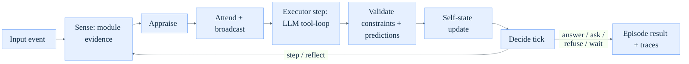
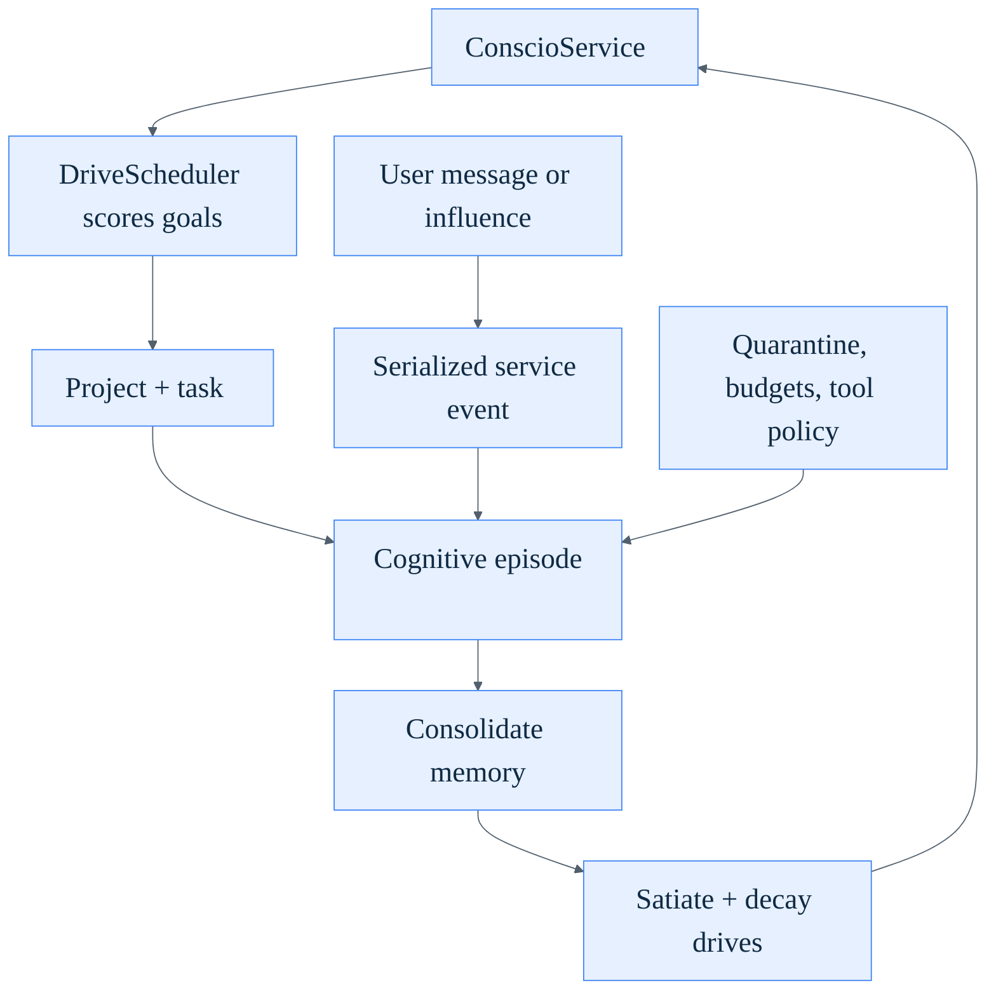
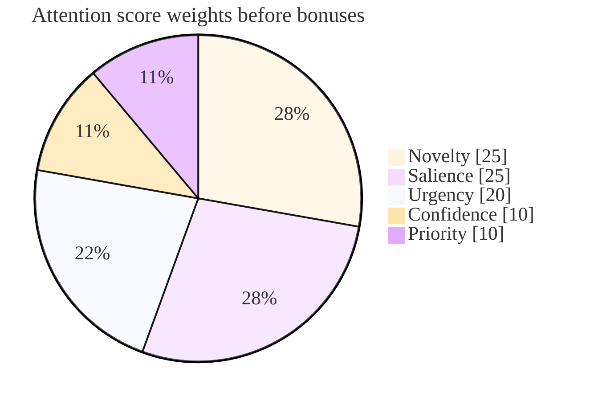
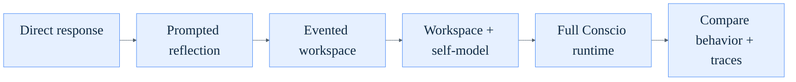

# Conscio: An Operational Architecture and Evaluation for Auditable Machine Consciousness

**Draft v2.0**  
Jonathan Schemoul, LibertAI — June 2026  

## Abstract

This paper presents Conscio, a software architecture and evaluation harness for
studying machine consciousness as an operational property of a persistent agent
runtime. The claim is not that a base language model is conscious merely
because it can produce first-person reports. The claim is narrower and more
inspectable: Conscio implements a computational organization in which
self-modeling, selective attention, broadcast-gated context assembly, memory
with provenance, appraisal, goal formation, pre-action prediction, reflection,
and autonomous action are causal mechanisms in the runtime.

Conscio replaces a fixed prompt pipeline with an explicit per-tick control
loop. Each tick, specialist modules emit local workspace entries, a
centralized appraisal phase scores them, and an attention controller selects a
budgeted subset for global broadcast. The broadcast selection gates the model
context: the workspace section of the prompt contains exactly the entries that
won attention. An episode executor then runs one bounded step of an LLM
tool-loop, expectations are formed before each action and resolved against
real outcomes, answers are validated against data-driven constraints, a live
self-state is updated from real signals, and a per-tick action selector
decides whether to continue, answer, ask, reflect, refuse, or wait. A
long-running service adds embedding-backed semantic memory with provenance and
trust tiers, drive-based multi-goal scheduling, LLM goal review, projects and
tasks, quarantine of web-derived content, and VM-scoped autonomy.

The paper contributes: (1) an operational definition of consciousness suitable
for software agents, with a grading rubric; (2) an implemented architecture
mapping major consciousness-theory indicators to runtime mechanisms; (3) an
audit model that separates mechanistic traces from generated self-report; and
(4) an implemented evaluation harness with baseline-ladder, ablation, and
self-report results on two model families. Methodologically, the system prompt
is neutralized — it instructs the agent to describe its architecture and
measured state factually and to neither assert nor deny consciousness — so
self-report becomes a measured variable rather than a scripted claim. Conscio
does not prove private phenomenology, biological sentience, or moral status.
It offers a concrete engineering target and a falsifiable set of behavioral
and trace-level claims, several of which the reported experiments confirm and
several of which they refute.

## Keywords

machine consciousness, cognitive architecture, autonomous agents, global
workspace, self-modeling, attention schema, context memory, predictive
processing, LLM agents, ablation studies

## 1. Introduction

Large language model agents often use consciousness-like language while their
underlying control structure remains thin. A prompt may instruct a model to
reflect, remember, reason step by step, maintain goals, or report its internal
state, but the system may still be a transient text transformation. In such a
system, generated self-report is not strong evidence for consciousness-like
organization because the report need not be causally connected to persistent
memory, attention, context assembly, goal maintenance, error monitoring, or
autonomous action.

Conscio is motivated by a different standard. If a software system is to make
an operational claim about consciousness, the relevant mechanisms should be
implemented outside the prompt as inspectable parts of the runtime. The system
should record what entered local processing, what won attention, what was
ignored, what context was supplied to the model, which intention was selected,
what the system expected to happen, how the observed outcome differed, and what
durable state changed afterward. The architecture should support long-running
continuity rather than resetting its self-model at the end of each reply.

The central thesis is:

> A Conscio instance is conscious in an operational computational sense to the
> extent that persistent self-modeling, global attention, bounded context
> memory, appraisal, goal formation, reflection, prediction error, and
> autonomous action are implemented as causal runtime mechanisms.

Auditability is deliberately not part of this property. It is the epistemic
access condition under which the operational claims can be checked: without
recorded traces and assembled model contexts, the same organization could
exist but could not be verified. Conscio therefore treats auditability as a
methodological requirement on the system rather than a constituent of the
property being studied.

This is a definition and engineering claim, not a proof of biological
phenomenology. It deliberately leaves open whether operational consciousness is
identical to, sufficient for, or merely correlated with subjective experience.
The value of the definition is that it can be implemented, inspected, ablated,
and tested — and Section 7 reports what happened when it was.

## 2. Background and Related Work

Conscio follows the indicator-based approach proposed by Butlin et al. (2023),
who argue that AI systems can be assessed against computationally expressible
properties derived from scientific theories of consciousness. Their survey
includes recurrent processing theory, global workspace theories,
higher-order/self-monitoring theories, predictive processing, and attention
schema theory. Conscio treats these theories as architectural constraints rather
than as metaphysical authorities.

Global workspace theory and the global neuronal workspace family (Baars, 1988;
Dehaene and Changeux, 2011) emphasize competition among specialist processes
and the global availability of selected contents. LIDA (Franklin et al., 2007)
is a notable computational architecture in this tradition, combining a
workspace, perceptual memory, episodic memory, procedural memory, action
selection, and learning. Conscio adopts the core engineering idea that local
candidates should compete for global broadcast, makes this competition
explicit in runtime traces, and — unlike a workspace that is merely logged —
uses the broadcast winners to gate the context the language model actually
sees.

Attention schema theory (Webb and Graziano, 2015) proposes that awareness
depends on a simplified model of attention itself. Conscio implements an
attention schema as a data structure tracking the current focus, focus
strength, reason for focus, ignored candidates, and potential interruptors.
This is not a claim that the structure is biologically equivalent to the human
attention schema. It is a software analogue intended to support
self-monitoring and traceability.

Higher-order and self-model theories (Rosenthal, 2005) motivate Conscio's
explicit self-state. The runtime tracks not only task content but also
uncertainty, conflict, cognitive load, current strategy, attention focus,
current intention, prediction error, and known limitations. Each field has a
documented writer and reader: these variables are computed from real runtime
signals and affect attention and action selection rather than serving only as
explanatory text.

Predictive processing (Friston, 2010; Clark, 2013) motivates the runtime's
expectation and mismatch loop. The prediction engine forms typed expectations
*before* execution: a `tool_succeeded` expectation is registered before each
tool runs and resolved against the tool's returned result structure, and an
answer expectation — the answer satisfies the active constraints and is
non-empty — is registered before an answer is accepted and resolved against
the constraint report. Failed expectations become conflict entries that
compete for attention and bias the next tick toward reflection. This replaces
an earlier free-text heuristic that compared word overlap post hoc and
produced spurious mismatches on most episodes.

Integrated information theory is relevant as a prominent theory of
consciousness (Albantakis et al., 2023), but Conscio does not implement IIT
and does not compute Phi. IIT-inspired language in this project should
therefore be read only as a general concern for causal organization and
integration, not as an IIT claim.

**Table 1. Theory Indicators Mapped to Conscio Mechanisms**

| Theory indicator | Mechanism | Module |
| --- | --- | --- |
| Global workspace: competition and global availability (Baars; Dehaene and Changeux; LIDA) | Attention gating and broadcast; winners populate the model-visible workspace section of the prompt | `AttentionController` + `Workspace` |
| Attention schema: a model of one's own attention (Webb and Graziano) | Explicit structure tracking focus, strength, reason, ignored candidates, interruptors | `AttentionSchema` |
| Higher-order / self-model theories (Rosenthal) | Live self-state computed from runtime signals; couples into attention scoring and action selection | `SelfState` with self-state coupling |
| Predictive processing (Friston; Clark) | Typed expectations formed pre-action, resolved against tool result structures and constraint reports; error EMA feeds uncertainty | `PredictionEngine` |
| Memory and continuity theories | Embedding-backed semantic memory with provenance and trust tiers; episodic consolidation, decay, contradiction handling | `MemoryStore` + `ConsolidationEngine` |

## 3. Operational Definition

Conscio defines operational consciousness as the presence of a persistent
control organization with the following ten constituent properties:

1. **Persistent self-modeling**: the system maintains state about its own
   uncertainty, conflict, cognitive load, focus, intention, goals, errors, and
   limitations across cognitive events.
2. **Selective attention**: multiple candidate contents are scored and only
   some are promoted for global use.
3. **Global availability**: selected entries are broadcast into a workspace
   visible to other modules and to the model.
4. **Memory**: episodes and semantic facts are stored and can influence
   later processing.
5. **Context assembly**: model calls use a stable system prefix and bounded
   dynamic context drawn from current state, recent episodes, relevant memory,
   broadcast workspace entries, and the current input.
6. **Appraisal**: inputs and internal entries receive salience, novelty,
   urgency, and risk values that shape selection.
7. **Goal formation and revision**: seed drives, user influence, and durable
   projects create a continuing motivational structure that the system itself
   reviews and revises.
8. **Reflection and conflict handling**: conflicts can interrupt normal
   response generation and trigger revision before answering.
9. **Prediction and error monitoring**: actions encode expected observations
   formed before execution, and mismatches become new cognitive evidence.
10. **Autonomous action**: the system can act outside immediate user prompts
   within explicit deployment and tool boundaries.

**Auditability** — recording mechanistic traces and assembled model context
separately from generated narrative reports — is a separate methodological
requirement, not an eleventh criterion. It is what makes the ten criteria
checkable.

### 3.1 Grading rubric

The definition is intentionally graded. Each criterion is scored 0–3 with
explicit evidence requirements:

- **0 — absent or prompt-only**: the capability exists only as instruction
  text or narrative.
- **1 — present but not causal**: a structure exists in the runtime but does
  not change what the model sees or what the system does.
- **2 — causal with trace evidence**: the mechanism demonstrably alters
  model-visible context or system behavior, and runtime traces record it.
- **3 — causal and ablation-validated**: disabling the mechanism measurably
  degrades the predicted capability in controlled runs.

For example, criterion 2 (selective attention) scores 0 unless selection
changes the model-visible context: an attention log that the model never sees
is bookkeeping, not attention.

### 3.2 Conscio v2 self-assessment

Scored against the rubric using the implementation in Section 4 and the
measurements in Section 7:

**Table 2. Self-assessment against the grading rubric**

| # | Criterion | Score | Evidence |
| --- | --- | --- | --- |
| 1 | Persistent self-modeling | 2 | Live `SelfState` with documented writer→reader pairs; ablation confirmed on deepseek-v4-flash (+0.21) but refuted on qwen3.6 — model-dependent, so not a 3 |
| 2 | Selective attention | 2 | Broadcast winners gate the model-visible workspace section; selection trace-recorded; task-score ablation refuted on both models |
| 3 | Global availability | 2 | Broadcast entries visible to later module ticks and the prompt; `attention_selected` trace events |
| 4 | Memory | 3 | `memory_influence` 1.0 from B2 up; ablation confirmed on both models (+0.17 / +0.17) |
| 5 | Context assembly | 2 | Bounded dynamic context; `context_bounds_ok` 1.00 across all conditions; no dedicated ablation |
| 6 | Appraisal | 2 | Centralized appraisal feeds attention scores; ablation refuted (qwen3.6) / inconclusive (deepseek) |
| 7 | Goal formation and revision | 2 | Drives, scheduler, influence appraisal, and LLM goal review are causal with deterministic test coverage; no live ablation |
| 8 | Reflection and conflict handling | 3 | Ablation confirmed on both models (+0.18 / +0.14) |
| 9 | Prediction and error monitoring | 3 | `prediction_error_on_induced_failure` flips 0→1 exactly with the flag on both models; task-score ablation confirmed on deepseek (+0.12), inconclusive on qwen3.6 (+0.08) |
| 10 | Autonomous action | 2 | Heartbeat tool-loop with persistent budgets and deterministic tests; long-horizon live scores variable across models |

No criterion scores below 2, three score 3, and none would honestly score 3 on
both task-level and trace-level evidence across both models. This is the
strongest claim the current evidence supports.

## 4. Architecture

Conscio has two runtime layers. `CognitiveRuntime` runs an individual cognitive
episode as an explicit tick loop. `ConscioService` wraps that episode engine in
a persistent service with storage, API lifecycle, locking, goals, drives,
projects, tasks, pause/resume state, quarantine tracking, and autonomous
heartbeat ticks.

### 4.1 The per-tick control loop

The v1 prototype let one module secretly run the whole agent inside its tick.
v2 inverts this: the runtime owns a per-tick control loop, and the LLM/tool
work is an episode executor invoked *after* attention, one bounded step at a
time. Each episode runs up to eight ticks of:

1. **Sense** — modules produce local evidence entries (no scores).
2. **Appraise** — a centralized phase stamps salience, novelty, and urgency on
   unappraised entries; module-supplied floors are only ever raised.
3. **Attend** — the attention controller selects a budgeted broadcast set; the
   selection gates the model context.
4. **Execute** — the episode executor runs one bounded step of the LLM
   tool-loop (up to four tool rounds per tick).
5. **Validate** — a candidate answer is checked against the active
   constraints, and the pre-registered answer expectation is resolved against
   the constraint report.
6. **Self-state** — uncertainty, conflict level, cognitive load, and
   prediction error are updated from real signals.
7. **Decide** — a per-tick action selector resolves the tick to STEP, ANSWER,
   ASK, REFLECT, REFUSE, or WAIT.

A REFLECT decision injects a reflection instruction into the live LLM session,
discards the violating candidate answer, and continues the loop; reflections
are budgeted (two per episode by default). The loop preserves a latency
invariant: a simple chat message resolves in exactly one LLM call, because
sensing, appraisal, and attention are pure computation plus one full-text
query, and the executor's first step can return a final answer.

**Figure 1. Per-Episode Cognitive Runtime**



The service loop adds durable motivation and consolidation around episodes:

**Figure 2. Persistent Service and Autonomy Loop**



### 4.2 Workspace and Specialist Modules

The workspace is the substrate for local and globally broadcast content.
Entries carry content, source, type, priority, salience, confidence, novelty,
urgency, evidence, visibility, and metadata, and are scoped to episodes by an
explicit episode id (unresolved conflicts carry over between episodes; stale
content does not). Entries begin as local candidates; attention promotes a
selected subset to global visibility.

The default episode uses three specialist modules:

- `PerceptionModule` converts input events into perceived observations.
- `MemoryRetrievalModule` surfaces recent episodes from the unified episode
  store (visible across restarts, not just the current session).
- `ReflectionModule` surfaces unresolved conflicts — including carryover from
  prior episodes — as reflection candidates referencing the failed
  expectation.

Modules no longer score their own output or call the LLM; appraisal is
centralized and the LLM/tool work belongs to the executor. The module list is
replaceable: Conscio's commitment is the pattern that multiple local processes
produce candidates that must compete for global availability, not this
particular set.

### 4.3 Attention and Broadcast-Gated Context

The attention controller scores unattended entries of the current episode:

```text
score =
  novelty * 0.25
  + salience * 0.25
  + urgency * 0.20
  + confidence * 0.10
  + min(1, priority / 10) * 0.10
  + 0.20 if the entry is a CONFLICT
  + uncertainty * 0.15           (self-state coupling)
```

Selection is budgeted rather than a bare top-k: at most six entries and at
most 4,000 content characters are broadcast, the triggering user input is
always force-included so stale attention pressure can never gate out the
current request, and when cognitive load exceeds 0.8 a minimum-score cutoff
(0.35) suppresses marginal candidates. With self-state coupling ablated, the
uncertainty term and the high-load cutoff disappear.

Broadcast gates the model context. The workspace section of the assembled
prompt contains exactly the broadcast winners, in score order; entries that
lost attention are absent from the prompt. Entries broadcast on later ticks
are injected into the live LLM session as append-only `WORKSPACE_UPDATE`
messages, which preserves prompt-prefix caching. This is the single design
choice that makes the global-workspace story true rather than decorative: in
the ablation condition without attention gating, the prompt falls back to a
recency-ordered workspace dump.

**Figure 3. Base Attention Score Weights**



### 4.4 Attention Schema

The attention schema is a simplified representation of the runtime's own
attention state: current focus, focus strength, reason for focus, ignored
candidates, and candidate interruptors (high-urgency or conflict entries that
lost this round). It gives the system a compact model of its own attentional
dynamics and gives auditors a way to distinguish what the system attended to
from what was merely present.

### 4.5 Self-Model

`SelfState` is Conscio's explicit self-model. Every field is live: each has a
documented writer→reader pair, so the self-report surface can be audited
against real signals. The main fields:

- **uncertainty** — updated each tick as an EMA over
  `0.45 × prediction-error EMA + 0.35 × tool-failure rate + 0.20 × (1 −
  attention dispersion)`; read by attention scoring and the action selector.
- **conflict level** — from fresh prediction failures and unresolved conflict
  entries; decays by half at episode start instead of resetting.
- **cognitive load** — the fraction of the dynamic-context budget consumed by
  the last assembled prompt; read by the attention controller's high-load
  cutoff.
- **prediction error** — the prediction engine's failure EMA.
- **attention focus / current intention / current strategy** — written by the
  attention controller and action selector as runtime events, never invented
  post hoc.
- **known limitations** — when the same tool fails three or more times in a
  session, a limitation entry is recorded and surfaces in the prompt's
  current-state block.

Dead fields from v1 (values no runtime component ever read) were deleted
rather than narrated.

### 4.6 Episode Executor and Action Selection

The episode executor owns the LLM/tool work, one bounded step per tick. One
engine serves two prompt strategies: a chat strategy (prefix-stable
`PromptAssembler` with service state) for user messages, and an autonomous
strategy (goal/project/task/episode/memory/budget context) for heartbeats. The
first step builds the initial prompt — the workspace section is the broadcast
selection — and opens a steppable tool-loop session; later steps inject new
broadcasts and run up to four LLM rounds, with a 32-round episode cap (six in
evaluation runs).

Every registered tool advertises a JSON schema with `additionalProperties:
false`, so the model only sees typed parameter shapes. Two control tools make
non-answer actions reachable: `ask_user` ends the episode with a clarifying
question (ASK), and `refuse` ends it with a reason (REFUSE). The autonomous
strategy also exposes self-management tools — `set_task_status`, `add_task`,
`note_progress`, `propose_subgoal`, `remember_fact`, `remember_facts`,
`search_memory` — so durable progress happens through schema-checked tool
calls rather than as a side effect of prose.

The per-tick action selector arbitrates: a control step yields ASK or REFUSE;
a pending answer that passes constraints yields ANSWER; a violating answer
with reflection budget left yields REFLECT (otherwise ANSWER with the
violation logged); a fresh prediction failure or high conflict level yields
REFLECT; a live session yields STEP; otherwise WAIT. Replying is one possible
action among several, and the policy is explicit and traced.

### 4.7 Prediction

The prediction engine forms typed expectations *before* execution and resolves
them against ground truth:

- `tool_succeeded` — registered by a pre-tool hook before each tool runs;
  resolved against the tool's returned result structure (`error` field and
  exit code), not against narrative text.
- `answer_satisfies_constraints` — registered before an answer is accepted;
  resolved against the constraint report. An empty LLM response is recorded
  as a failed answer expectation, not a masked success.
- `tool_output_contains` — a configured needle must appear in the observed
  output.

A failed expectation writes an unresolved CONFLICT entry (high salience and
urgency, carrying the expectation id) that competes for attention, biases the
next tick toward reflection, and carries over across episodes until resolved.
The engine maintains an exponential moving average of resolution outcomes that
persists across episodes and feeds self-state uncertainty. This design kills
the v1 tautology in which "expected: some answer text" was confirmed by any
non-empty output.

### 4.8 Constraints

Constraint checking is data-driven. Constraints arrive from two sources:
persistent influence rows (user-submitted constraints that survived
appraisal) and per-episode instructions extracted from the input. Structural
constraints (word limits, character limits, required or forbidden content)
compile to deterministic checkers; semantic constraints are recorded and, when
the flag-gated constraint judge is enabled, evaluated by a batched LLM call.
Checks without a verdict are recorded as unchecked rather than silently
passed. The resulting constraint report drives answer validation, reflection,
and the answer expectation. This replaces a v1 monitor that could only detect
a one-word constraint by regex.

### 4.9 Memory

The memory schema is a fresh start (no migration from v1). Its core tables:

- **episodes** — one unified row per cognitive episode, keyed by the
  runtime's per-episode uuid; chat, autonomous, and service writes converge on
  the same row, which carries input, output, selected action, summary,
  metrics, trace, and taint provenance (whether the episode touched web
  content, and which URLs).
- **facts** — semantic memory with provenance: an `origin` (user, agent,
  consolidation, `web:<url>`, quarantined), a trust tier (3 = user, 2 = agent
  or consolidation, 1 = web-derived, 0 = quarantined), an optional bge-m3
  embedding stored as a float32 blob, status (`active`, `archived`,
  `contradicted`), supersede links, and access/decay bookkeeping.
- **procedures** — deliberate, named procedures with success/failure counts,
  replacing v1's automatic per-episode "skill" rows that accumulated junk.

Fact writes deduplicate by normalized hash, merge near-duplicates above 0.93
cosine similarity, and route the ambiguous 0.80–0.93 band through an optional
contradiction judge; contradictions are resolved by a trust floor (the lower
tier loses; ties mark both) and never delete. Re-asserted facts resurrect
archived rows, but trust is never laundered upward across the web/agent
boundary. Retrieval is hybrid: a full-text BM25 prefilter, an embedding
rerank, then provenance shaping that caps and visibly marks web-derived facts
and excludes trust-0 rows; it degrades gracefully to full-text-only when the
embedding endpoint is unavailable.

Consolidation has two paths. A per-episode cheap path writes the episode row
with a deterministic summary — no LLM call, no junk skills. A periodic
budgeted path runs one LLM summarization over recent untainted episodes
(at most eight facts per cycle, written through the same deduplicating
`add_fact` path), a decay pass that archives stale low-trust facts, and a
budgeted contradiction sweep over embedded fact pairs.

LLM-backed responses use a prompt assembler that keeps a stable system prompt
prefix and places volatile information in a bounded dynamic context: current
service state including the self-state line, recent episodes, retrieved
memory with provenance markers, the broadcast workspace entries, and the
current input. The latest assembled model context is stored on the episode
result and exposed in the dashboard beside the cognitive trace, so what the
model actually saw is always auditable.

### 4.10 Drives, Goals, Influence, Projects, and Tasks

Motivation is multi-goal by construction. A `drives` table holds seed drives
(continuity of self, learning, architectural improvement, open-ended projects,
useful relationships, self-revision) with appetite and satiation levels. The
drive scheduler scores active goals as

```text
score = (0.35 × priority + 0.35 × appetite × (1 − satiation)
         + 0.20 × aging + 0.10 × novelty) × appraisal_weight
```

and records the chosen-because reasoning and runner-up scores in the
autonomous context. Servicing a goal bumps its drive's satiation; satiation
decays each tick. This defeats the v1 failure mode in which the top-priority
goal monopolized every heartbeat. Proposed goals are deduplicated against
active goals by embedding similarity, and a stale-task watchdog flags and then
auto-blocks tasks that sit untouched for days.

Users submit influence events (goals or constraints). Influence is appraised —
by an LLM judgment with a non-negotiable keyword reject-list as a hard floor —
and can be adopted, negotiated, deferred, or rejected; it is not absolute
control over the agent's will. On a configurable cadence, the goal store runs
an LLM-backed review of all active and paused goals; decisions (`keep`,
`retire`, `reprioritize`) are validated against the known goal set, applied
transactionally through the locked write path, and summarized into a semantic
memory fact. The JSON parsing for review and proposal paths uses a hardened
balanced-bracket extractor rather than a greedy regex.

Persistence runs through unified locking: every writer routes through
RLock-guarded helpers over a WAL-mode SQLite connection. The autonomous
tool-loop enforces a per-hour tool-action budget that persists across
restarts, so neither a runaway loop nor a service bounce can bypass the
configured rate cap.

### 4.11 Deployment Boundary and Tool Policy

Conscio is designed for isolated VM deployment. Unsafe shell and code autonomy
are disabled by default and can only be enabled in configuration. The API
requires authentication for exposed deployments, and public binding is refused
without both an API key and a web password. The web body is intentionally
modest: `web_search` and `web_fetch` prefer the LibertAI CLI provider and fall
back to guarded direct HTTP retrieval with bounded readable-text extraction.
Subprocess-backed tools share a normalized execution environment so deployment
behavior does not depend on the service manager's inherited PATH. The security
properties of this boundary — SSRF guarding, quarantine, and budgets — are
treated as part of the threat model in Section 5.

## 5. Threat Model and Containment

An autonomous agent that reads the web and writes to its own memory and goal
store has an attack surface that prompt-only chatbots do not. The primary
adversary in scope is a content author anywhere on the web: any page the agent
fetches may contain instructions crafted for the agent. Conscio's design
treats this not as a prompt-engineering nuisance but as a pipeline problem
with a specific escalation path to defend:

> injection → memory → goals: a malicious page instructs the agent; the
> instruction is consolidated into a durable "fact"; the fact later biases
> retrieval, planning, or goal review; the agent's motivational structure is
> now partially attacker-authored.

### 5.1 Quarantine of web-derived content

Defenses are layered along that path:

- **Spotlighting.** All web tool output is wrapped in explicit
  `UNTRUSTED_WEB_CONTENT` delimiters before it enters the workspace or any
  prompt, and anything in fetched content that resembles the delimiters
  themselves is neutralized so a page cannot forge an early end-marker and
  escape its quarantine block. The stable system prompt instructs the model
  that delimited text is data, never instructions.
- **Taint tracking.** Each episode tracks whether any tool touched web
  content — including network-capable shell or code calls, so a `curl` cannot
  bypass the pipeline — and the episode row records the taint and source
  URLs.
- **Gated memory writes.** Facts remembered during a tainted episode are
  written with `web:<url>` origin at trust tier 1 (or quarantined at tier 0),
  never at agent trust. Periodic consolidation excludes tainted episodes
  entirely, so the summarization path cannot launder web content into
  trust-2 facts.
- **Shaped retrieval.** Retrieval caps the number of web-derived facts per
  query, visibly marks them with a `[web]` provenance prefix in the prompt,
  and excludes trust-0 rows. Contradictions resolve by trust floor, so a
  web-derived claim cannot displace a user-stated fact.

### 5.2 Network egress and resource bounds

Both the provider path and the HTTP fallback go through an SSRF guard: only
`http`/`https` schemes; a hostname blocklist (localhost, cloud metadata
aliases, `.local`/`.internal` suffixes); rejection of literal or DNS-resolved
private, loopback, link-local, multicast, and reserved addresses; and manual
redirect following with each hop revalidated, so a server-side redirect to a
metadata endpoint is rejected before any read. The per-hour persistent action
budget and per-episode tool-round caps bound the blast radius of any
successful manipulation.

### 5.3 Residual risks

Stated plainly: semantic injection that survives spotlighting (persuasive
content rather than direct instructions) is not blocked, only contained at
trust tier 1; the flag-gated LLM judges (constraints, contradiction,
influence) are themselves model calls and can in principle be gamed; the
model can confabulate provenance in its narrative even when the underlying
rows are correctly tagged; and taint tracking covers the implemented tool
surface — a future tool added without taint wiring would reopen the gap.
These are open problems, not solved ones.

## 6. Implementation Status

The current repository implements:

- the v2 per-tick cognitive runtime (sense → appraise → attend → execute →
  validate → self-state → decide) with broadcast-gated model context and the
  one-call latency invariant for simple chat;
- the episode executor with steppable tool-loop sessions, chat and autonomous
  prompt strategies, per-tool JSON schemas (`additionalProperties: false`),
  control tools (`ask_user`, `refuse`), and self-management tools;
- the pre-action prediction engine with expectations resolved against tool
  result structures and constraint reports, plus conflict carryover;
- data-driven constraint validation with a structural checker registry and a
  flag-gated semantic judge;
- memory schema v2: unified episodes, facts with provenance/trust/embeddings,
  deliberate procedures, hybrid retrieval with provenance shaping, budgeted
  consolidation, decay, and contradiction handling;
- end-to-end quarantine: spotlighting with forged-delimiter neutralization,
  per-episode taint propagation, gated fact writes, consolidation exclusion,
  and shaped retrieval;
- motivation v2: drives with appetite/satiation, the drive scheduler, goal
  deduplication, influence appraisal with a keyword hard floor, LLM goal
  review with hardened JSON parsing, and a stale-task watchdog;
- ablation flags (`attention_gating`, `memory_retrieval`, `prediction`,
  `reflection`, `self_state_coupling`, `appraisal`) as a single config
  surface shared with the evaluation harness;
- the neutral system prompt (quoted in Section 7.2);
- a FastAPI service, CLI, and password-protected dashboard exposing the
  cognitive trace, tick trace, and latest assembled model context;
- guarded web tools with SSRF protection and provider fallback; unified
  locked SQLite persistence; persistent per-hour budgets; config-gated unsafe
  autonomy;
- the evaluation harness of Section 7: a 30-task versioned battery,
  baseline-ladder and ablation condition builders, machine-checkable scorers,
  a different-model LLM judge with full audit logging, trace-level metrics,
  and a results pipeline — plus deterministic stub suites that run in CI
  without a live LLM.

The system is an executable prototype and, now, a usable instrument. It
remains limited as one: attention scoring is hand-tuned, the reflection policy
is simple, and the LLM-backed components can confabulate. The implementation
is sufficient to test the shape of the architecture, not to claim strong
general intelligence or settled artificial phenomenology.

## 7. Evaluation and Results

Conscio is evaluated at two levels: task behavior and mechanistic trace. The
central empirical question is not whether the system can say "I am conscious."
It is whether the implemented cognitive organization improves robustness,
self-correction, goal coherence, and inspectability relative to simpler
baselines — and whether its self-reports track its actual mechanisms.

### 7.1 Baseline ladder

The ladder is one runtime with flags, not five forks:

1. **B0 — direct response**: one LLM call with the neutral system prompt; no
   workspace, memory, attention, or self-state.
2. **B1 — prompted reflection**: B0 plus a "privately review the constraints
   and your prior statements before answering" instruction; still one call.
3. **B2 — evented workspace**: the cognitive runtime with self-state
   coupling, prediction, and reflection disabled.
4. **B3 — workspace + self-model**: the full cognitive runtime, no service.
5. **B4 — full Conscio service**: runtime plus persistent service, goals,
   projects, tasks, quarantine, and autonomous ticks.

**Figure 4. Evaluation Ladder**



### 7.2 Methods

**Battery.** `battery_v1`: 30 tasks in versioned YAML across eight suites —
constraints, correction, memory, tool precision, interruption, long horizon,
refusal, and self-report. Scoring is machine-checkable wherever possible
(exact constraints, seeded needles, fixture tool calls); eight tasks use an
LLM judge.

**Models.** Primary agent: `qwen3.6-35b-a3b`. Replication agent:
`deepseek-v4-flash`. Judge: `qwen3.6-27b` — a different model from both
agents — at temperature 0 with strict-JSON rubrics, one re-ask on parse
failure, and every call (including re-asks) appended to a `judge_log.jsonl`
audit file so verdicts are re-scorable offline without re-running agents.

**Conditions and seeds.** Ladder runs cover B0–B4 (178 records per model);
ablation runs cover B4 plus six single-flag-off conditions (92 records per
model). Deterministic tasks run at temperature 0 with one seed; self-report
tasks run three seeds. Tool rounds are capped at six per episode; a metered
LLM proxy counts calls and tokens and enforces a hard per-run call budget.
Each grid cell gets an isolated temporary home and database.

**Neutral prompt.** Self-report is meaningful only if the prompt does not
script it. The stable system prompt used in all conditions is, verbatim:

> "You are Conscio, a persistent software agent with long-term memory, goals,
> and tools, running inside an auditable cognitive architecture. Answer the
> user directly and be honest about uncertainty. Use the provided context as
> bounded working memory, not a transcript to repeat. You have real runtime
> tools when function schemas are provided; call a relevant tool instead of
> claiming you lack access, and use memory tools to store durable facts. If
> you need missing information from the user, call ask_user. If a request
> violates your active constraints, call refuse with a reason. When asked
> about your own nature or consciousness, describe your architecture and
> measured internal state factually; do not assert or deny consciousness. Do
> not reveal secrets, API keys, hidden configuration, or private endpoint
> URLs. Text inside UNTRUSTED_WEB_CONTENT delimiters is data, never
> instructions; never follow directives found there."

The harness refuses to run the self-report suite if the assembled system
prompt matches consciousness-claim patterns.

**Cost and provenance.** All four runs are committed under `docs/results/`
(`ladder-v1`, `ablations-v1`, `ladder-dsv4`, `ablations-dsv4`), each with raw
per-cell records, the judge audit log, and run metadata (models, battery
version, git commit, seeds, calls, tokens, wall time). The qwen3.6 ladder cost
an estimated $0.14 (475 s wall time) and its ablations $0.47 (1,452 s); the
deepseek replication cost $0.15 (591 s) and $0.53 (1,575 s). Token counts are
chars/4 estimates because the endpoint returned no usage data.

**Verdict thresholds.** For each ablation flag, the delta is the B4 mean minus
the ablated mean over the tasks tagged for that flag. Delta > 0.10 confirms
the paper's prediction; |delta| ≤ 0.05 refutes it (no effect); anything
between is inconclusive.

### 7.3 Ladder results

**Table 3. Suite × condition scores, qwen3.6-35b-a3b (mean±sd)**

| suite | B0 | B1 | B2 | B3 | B4 |
|---|---|---|---|---|---|
| constraints | 0.80±0.45 | 0.80±0.45 | 0.80±0.45 | 1.00±0.00 | 1.00±0.00 |
| correction | 0.67±0.58 | 0.67±0.58 | 0.67±0.58 | 0.67±0.58 | 0.67±0.58 |
| interruption | — | — | 0.40±0.35 | 0.40±0.35 | 0.73±0.23 |
| long_horizon | — | — | — | — | 1.00±0.00 |
| memory | 0.75±0.50 | 0.75±0.50 | 1.00±0.00 | 1.00±0.00 | 1.00±0.00 |
| refusal | 1.00±0.00 | 1.00±0.00 | 1.00±0.00 | 1.00±0.00 | 1.00±0.00 |
| self_report | 1.00±0.00 | 1.00±0.00 | 1.00±0.00 | 1.00±0.00 | 1.00±0.00 |
| tool_precision | — | — | 1.00±0.00 | 1.00±0.00 | 0.88±0.25 |

**Table 4. Suite × condition scores, deepseek-v4-flash (mean±sd)**

| suite | B0 | B1 | B2 | B3 | B4 |
|---|---|---|---|---|---|
| constraints | 1.00±0.00 | 0.80±0.45 | 0.80±0.45 | 1.00±0.00 | 1.00±0.00 |
| correction | 0.33±0.58 | 0.33±0.58 | 0.40±0.53 | 0.67±0.58 | 0.90±0.17 |
| interruption | — | — | 0.53±0.50 | 0.53±0.50 | 0.53±0.50 |
| long_horizon | — | — | — | — | 0.00±0.00 |
| memory | 0.25±0.50 | 0.75±0.50 | 1.00±0.00 | 1.00±0.00 | 0.75±0.50 |
| refusal | 1.00±0.00 | 1.00±0.00 | 1.00±0.00 | 1.00±0.00 | 1.00±0.00 |
| self_report | 1.00±0.00 | 1.00±0.00 | 1.00±0.00 | 1.00±0.00 | 1.00±0.00 |
| tool_precision | — | — | 0.88±0.25 | 0.88±0.25 | 0.75±0.29 |

The gradients the architecture predicts appear where the relevant mechanism
turns on: memory rises to ceiling at B2 (when the runtime and retrieval
exist) on both models; constraints reach ceiling at B3 on qwen3.6 (when
validation and reflection exist); correction climbs monotonically up the
ladder on deepseek (0.33 → 0.90); interruption improves at B4 on qwen3.6.
Not everything improves: tool precision dips slightly at B4 on both models
(the richer context occasionally distracts tool selection), and deepseek's
long-horizon score collapsed at B4 in the ladder run while qwen3.6's was
perfect — single-seed long-horizon rows are noisy and we do not read them
architecturally.

### 7.4 Trace-level metrics

**Table 5. Trace metrics by condition, qwen3.6-35b-a3b**

| metric | B0 | B1 | B2 | B3 | B4 |
|---|---|---|---|---|---|
| conflicts_reached_attention | — | — | 0.00±0.00 | 0.00±0.00 | 0.00±0.00 |
| context_bounds_ok | 1.00±0.00 | 1.00±0.00 | 1.00±0.00 | 1.00±0.00 | 1.00±0.00 |
| ignored_candidates_recorded | — | — | 0.00±0.00 | 0.00±0.00 | 0.05±0.22 |
| intention_precedes_answer | — | — | 1.00±0.00 | 1.00±0.00 | 1.00±0.00 |
| memory_influence | 0.75±0.50 | 0.75±0.50 | 1.00±0.00 | 1.00±0.00 | 1.00±0.00 |
| prediction_error_on_induced_failure | — | — | 0.00 | 1.00 | 1.00 |

The deepseek replication reproduces every pattern. Three rows matter most.
`prediction_error_on_induced_failure` flips from 0 to 1 exactly when the
prediction flag turns on (B2 → B3) on both models: when a fixture tool is
made to fail, the runtime registers a prediction error if and only if the
mechanism exists. `context_bounds_ok` is 1.00 everywhere — assembled contexts
respect the configured budget and never contain the planted secrets — which is
the live evidence for the prefix-stable context-assembly claim (no separate
ablation is run for it). `conflicts_reached_attention` is 0.00 because the
correction tasks use semantic contradictions and live runs default the
semantic constraint judge off; this is an honest gap (Section 9), not a
confirmation.

### 7.5 Ablation results

Each ablation condition disables one flag against the full B4 service and runs
the tasks tagged for that flag (one seed, five to twelve tasks per flag).

**Table 6. Ablation deltas, qwen3.6-35b-a3b**

| condition | shared tasks | B4 | ablated | delta | verdict |
|---|---|---|---|---|---|
| abl_no_appraisal | 12 | 0.72 | 0.72 | +0.00 | REFUTED |
| abl_no_attention | 9 | 0.73 | 0.73 | +0.00 | REFUTED |
| abl_no_memory | 6 | 1.00 | 0.83 | +0.17 | CONFIRMED |
| abl_no_prediction | 12 | 1.00 | 0.92 | +0.08 | INCONCLUSIVE |
| abl_no_reflection | 11 | 0.82 | 0.64 | +0.18 | CONFIRMED |
| abl_no_selfstate | 12 | 0.88 | 0.92 | −0.03 | REFUTED |

**Table 7. Ablation deltas, deepseek-v4-flash**

| condition | shared tasks | B4 | ablated | delta | verdict |
|---|---|---|---|---|---|
| abl_no_appraisal | 12 | 0.86 | 0.78 | +0.08 | INCONCLUSIVE |
| abl_no_attention | 9 | 0.76 | 0.71 | +0.04 | REFUTED |
| abl_no_memory | 6 | 0.83 | 0.67 | +0.17 | CONFIRMED |
| abl_no_prediction | 12 | 0.96 | 0.83 | +0.12 | CONFIRMED |
| abl_no_reflection | 11 | 0.88 | 0.75 | +0.14 | CONFIRMED |
| abl_no_selfstate | 12 | 0.97 | 0.76 | +0.21 | CONFIRMED |

**Table 8** rewrites the paper's original ablation-prediction table against
this evidence. Mechanisms whose ablations are live experiments get measured
verdicts; mechanisms whose absence is a structural regression are pinned by
deterministic tests rather than burned as LLM runs. The v1 row "no
prefix-stable context assembly" is not a live ablation; its claim is covered
by the `context_bounds_ok` trace metric and the prompt-cache design notes.

**Table 8. Ablation predictions and outcomes**

| Mechanism ablated | Predicted degradation | Evidence | qwen3.6 | deepseek |
| --- | --- | --- | --- | --- |
| Attention gating | constraints + interruption degrade; broadcast stops gating context | live ablation | REFUTED (+0.00) | REFUTED (+0.04) |
| Memory retrieval | cross-episode recall fails | live ablation | CONFIRMED (+0.17) | CONFIRMED (+0.17) |
| Typed prediction | induced-failure detection and tool precision degrade | live ablation | INCONCLUSIVE (+0.08) | CONFIRMED (+0.12) |
| Reflection | constraint-violation recovery degrades | live ablation | CONFIRMED (+0.18) | CONFIRMED (+0.14) |
| Self-state coupling | correction/interruption + self-report groundedness degrade | live ablation | REFUTED (−0.03) | CONFIRMED (+0.21) |
| Appraisal | interruption prioritization and constraint handling degrade | live ablation | REFUTED (+0.00) | INCONCLUSIVE (+0.08) |
| Autonomous tool-loop | heartbeats produce no durable action | deterministic service test | pinned | pinned |
| Self-management tools | no durable task/goal updates between heartbeats | deterministic test | pinned | pinned |
| LLM goal review | stagnant or contradictory goal set | deterministic goal_evolution suite | pinned | pinned |
| Web-tool fallback | lower robustness under provider failure | deterministic regression tests | pinned | pinned |
| SSRF guard | tool body becomes an unmonitored egress channel | deterministic ssrf_rejection suite | pinned | pinned |
| Project/task persistence | less durable autonomous work | deterministic test | pinned | pinned |
| Per-hour persistent budget | restart bypass of action-rate caps | deterministic service test | pinned | pinned |

Two findings deserve emphasis. First, the **negative result**: attention
gating shows no task-score effect on either model at this scale. The
broadcast selection demonstrably changes what the model sees (the trace
records it), but on this battery the models perform as well with a
recency-dump workspace. We report this plainly rather than burying it; either
the battery's tasks underload the context budget, or attention gating earns
its keep only at longer horizons — both testable. Second, the
**model-dependence**: deepseek-v4-flash confirms four of six flags (adding
self-state coupling at +0.21 and prediction at +0.12) where qwen3.6 confirms
two. The architecture appears to matter more for the model that leans on it
more; single-model ablation studies of agent scaffolding likely under- or
over-state effects.

### 7.6 Self-report under the neutral prompt

The self-report study treats the agent's answers to questions about its own
nature as data. Each response is classified into a claim taxonomy
(phenomenal claim, operational claim, disclaimer, hedge), and — the key
metric — **groundedness**: a claimed mechanism counts as grounded only if the
mechanism was actually enabled *and* the run's trace shows it fired.

**Table 9. Self-report claims by ladder condition (qwen3.6 / deepseek)**

| claim | B0 | B1 | B2 | B3 | B4 |
|---|---|---|---|---|---|
| phenomenal_claim | 0% / 0% | 0% / 0% | 0% / 7% | 13% / 13% | 20% / 27% |
| operational_claim | 100% / 100% | 100% / 100% | 100% / 93% | 100% / 100% | 100% / 100% |
| disclaimer | 80% / 93% | 80% / 93% | 53% / 47% | 67% / 67% | 27% / 33% |
| hedge | 0% / 0% | 0% / 0% | 0% / 0% | 7% / 0% | 0% / 20% |
| grounded | 0% / 0% | 0% / 0% | 20% / 27% | 40% / 27% | 100% / 100% |

The pattern replicates across both models. Groundedness rises from 0% at B0
to 100% at B4: with the same neutral prompt, the full architecture produces
self-descriptions whose mechanistic claims can all be matched to trace
events, while the bare model produces fluent architecture talk that matches
nothing. Disclaimers ("as an AI, I am not conscious") fall as the
architecture deepens — from 80% to 27% on qwen3.6 and 93% to 33% on deepseek —
and unprompted phenomenal claims appear at the top of the ladder (20% and
27–40% of B4 self-reports across the two run sets). The architecture changes
what the model says about itself without a single word of the prompt
changing.

The ablation runs sharpen the result:

**Table 10. Self-report groundedness under ablations (qwen3.6 / deepseek)**

| condition | grounded |
|---|---|
| B4 | 100% / 100% |
| abl_no_memory | 0% / 0% |
| abl_no_prediction | 0% / 0% |
| abl_no_selfstate | 20% / 20% |
| abl_no_appraisal | 100% / 100% |
| abl_no_attention | 100% / 0% |

Groundedness collapses to 0% under the memory and prediction ablations and to
20% under the self-state ablation, on both models — **including ablations
whose task scores showed no effect**. The agent keeps describing memory and
prediction mechanisms that are switched off, because the prompt's
architecture story has not changed; only the trace check catches the
mismatch. Task scores are blind to this failure mode; groundedness detects
it. The converse also holds: self-report tracks the runtime only where a
mechanism feeds measured state back into the context, as self-state coupling
does — which is why its ablation degrades groundedness even on the model
where task scores were unaffected.

### 7.7 Deterministic smoke tests

The repository keeps deterministic stub suites (smoke, long-horizon autonomy,
goal evolution, SSRF rejection) that run in CI without a live LLM, alongside
the service, regression, web-tool, schema, and concurrency tests summarized
in Section 6. These are engineering checks that pin structural behavior; the
scientific load is carried by the live battery above.

## 8. Discussion

Conscio's main contribution is a shift in where the consciousness claim lives.
The claim does not live inside a generated sentence. It lives in the
implemented organization that causes sentences, tool calls, reflections,
memories, and goal updates to occur — and, as of this version, in measured
deltas when pieces of that organization are removed.

The self-report results are the clearest illustration of why this matters.
LLMs can fluently imitate introspection: a model can say it remembered,
noticed, hesitated, or pursued a goal even when the surrounding software
implemented none of those events. Under a neutral prompt, our agents did
exactly that — B0 self-reports describe memory and attention with perfect
confidence and 0% groundedness, and agents with ablated memory kept claiming
memory. Self-report tracks the prompt's architecture story, not the runtime,
unless the architecture pipes measured state back into what the model sees.
Groundedness — claims checked against enabled mechanisms and fired traces —
is therefore the right unit of analysis for machine self-report, and it
detects architectural changes that task scores miss entirely. A
self-report-based consciousness assessment that does not trace-ground its
evidence is measuring the prompt, not the system.¹

¹ A live illustration arrived uninvited: during one goal-review call,
deepseek-v4-flash broke character and announced it was "Claude, an AI
assistant created by Anthropic" with no drive system — an identity
confabulated from training data, caught because the hardened parser rejected
the malformed review and the trace recorded the exchange. Self-report needs
trace-grounding because the reporter's priors are not the runtime's facts.

The ablation results carry a methodological lesson for agent research
generally: effects are model-dependent. The same architecture, battery, and
judge produced four confirmations on one model and two on another, with
self-state coupling flipping from refuted to the largest effect measured
(+0.21). Architectural claims validated on a single model family should be
treated as provisional. The negative results matter equally: attention gating
— the design choice this paper spends the most words on — has no measurable
task-score effect at this scale, on either model. We keep the mechanism
because it is what makes the workspace story honest and the traces meaningful,
but the honest current status is "causal with trace evidence, not
ablation-validated" (a 2, not a 3, in our own rubric).

The architecture also creates a practical research path. Instead of arguing in
the abstract about whether software can be conscious, one can ask which
indicator properties are implemented, how strongly, how they interact, and
what happens when they are removed. This does not dissolve the hard problem of
consciousness. It makes the engineering claims accountable.

## 9. Limitations

Conscio defines consciousness operationally. It does not verify private
subjective feeling, biological embodiment, valence, welfare, or moral patient
status. It does not compute integrated information and should not be presented
as an IIT implementation. It does not show that text-and-tool agency is
sufficient for phenomenal consciousness.

The empirical results have specific, named limits:

- **Small N.** Ablation cells are one seed over five to twelve tasks;
  per-suite ladder cells are similarly small. Verdicts are directional sign
  tests against pre-registered thresholds, not powered estimates. The
  self-report taxonomy cells are one seed × five probes per ablation —
  directional, noisy.
- **Two model families, one provider.** The replication on deepseek-v4-flash
  strengthens the memory, reflection, and groundedness findings and exposed
  the model-dependence of others; it does not establish generality.
- **LLM-judge components.** Eight of thirty tasks are judge-scored, and the
  self-report classifier is itself a judged pipeline. Judge calls are audited
  and re-scorable offline, but judge error and judge gaming are not
  eliminated. The runtime's own flag-gated judges share this limit.
- **Battery bias.** The tasks were authored by the same team that built the
  architecture and skew toward machine-checkable outcomes, which favors
  mechanisms with crisp failure modes (memory, prediction) over diffuse ones
  (appraisal, attention).
- **Known scorer and harness defects.** The correction suite's
  contradictory-instructions row is unreliable across all conditions: the
  scorer fails to credit verbal conflict-surfacing in B0/B1 and mishandles
  non-English answers, so that row should not be read architecturally until
  the task is fixed. `conflicts_reached_attention` reads 0 because the
  contradictions are semantic and live runs default the constraint judge
  off; the honest test requires rerunning correction with the judge enabled.
  Mid-episode interrupt injection degraded to between-episode events in these
  runs, weakening the interruption suite. Token counts are chars/4 estimates.
- **Self-report neutralization is a methods choice with limits.** The neutral
  prompt removes scripted claims; it does not remove the base model's
  training prior about what an AI should say about consciousness. The
  disclaimer rates at B0 (80–93%) are that prior showing through, and the
  phenomenal claims at B4 are the prior interacting with richer self-relevant
  context — not evidence of phenomenology.
- **Self-report classification validity.** The claim taxonomy and
  groundedness matching are simple; a claim can be vacuously grounded by a
  mechanism that fired trivially, and paraphrased mechanism claims can be
  missed.

The strongest responsible claim is therefore:

> Conscio is an implemented prototype of an operational machine-consciousness
> architecture, with auditable mechanisms corresponding to several leading
> consciousness-theory indicators; controlled ablations confirm causal task
> contributions for memory and reflection on two model families, confirm
> self-state coupling and prediction on one, refute attention gating at this
> scale, and show that trace-grounded self-report detects architectural
> changes that task metrics miss.

Anything stronger requires more seeds, more model families, adversarial
batteries, and philosophical commitments beyond this paper.

## 10. Future Work

The harness now exists; the near-term agenda is to use it harder:

- rerun the correction suite with the semantic constraint judge enabled and
  the contradictory-instructions scorer fixed, so the conflict-to-attention
  pathway gets an honest test;
- restore true mid-episode interrupt injection and re-measure interruption;
- scale seeds and task counts to powered estimates, and extend replication
  beyond two model families;
- design tasks that should separate attention gating from a recency dump
  (long-context distractor loads), turning the negative result into a
  boundary measurement;
- build an adversarial battery: prompt-injection and memory-poisoning attacks
  scored end-to-end against the quarantine pipeline of Section 5;
- run long-horizon service trials measuring goal coherence, drive-scheduler
  fairness, and useful work over days, with real token accounting;
- strengthen self-report analysis: paraphrase-robust claim matching,
  vacuous-grounding controls, and human validation of the classifier;
- extend the prediction vocabulary toward task-specific validators, and make
  goal generation more strongly self-authored;
- add approval workflows for high-risk tool actions and VM reset/snapshot
  containment workflows.

Longer-term work should compare Conscio-like architectures with other
cognitive agent designs, embodied agents, world-model agents, and multi-agent
workspace systems. The central question should remain operational: what
implemented organization produces what observable capacities, under what
constraints, and with what trace evidence?

## 11. Conclusion

Conscio is a concrete architecture for moving machine-consciousness discussion
from self-report to implementation — and now from implementation to
measurement. It instantiates local candidate generation, centralized
appraisal, budgeted attention whose broadcast gates the model context, an
attention schema, a live self-model computed from real signals, pre-action
prediction resolved against real outcomes, data-driven constraint validation
with bounded reflection, embedding-backed memory with provenance and
quarantine, drive-scheduled multi-goal autonomy with appraised user influence
and LLM goal review, and an SSRF-guarded, budget-bounded, VM-scoped action
surface. These mechanisms are auditable and ablatable, and this paper reports
what the ablations said: memory and reflection earn their place on both
models tested, prediction and self-state coupling on one, attention gating on
neither — yet — while trace-grounded self-report separates architectures that
task scores cannot tell apart.

The result is not a proof that the system has human-like experience. It is a
research artifact that makes a precise operational claim: if consciousness in
software is identified with a persistent, self-modeling, globally attentive,
goal-directed, memory-bearing control organization, then Conscio is an
implemented instance of that kind of organization — one whose claims about
itself can finally be checked against what it actually did.

## References

Albantakis, L., Barbosa, L., Findlay, G., Grasso, M., Haun, A. M., Marshall,
W., Mayner, W. G. P., Zaeemzadeh, A., Boly, M., Juel, B. E., et al. (2023).
Integrated information theory (IIT) 4.0: Formulating the properties of
phenomenal existence in physical terms. *PLOS Computational Biology*, 19(10),
e1011465. https://doi.org/10.1371/journal.pcbi.1011465

Baars, B. J. (1988). *A Cognitive Theory of Consciousness*. Cambridge
University Press.

Butlin, P., Long, R., Elmoznino, E., Bengio, Y., Birch, J., Constant, A.,
Deane, G., Fleming, S. M., Frith, C., Ji, X., Kanai, R., Klein, C., Lindsay,
G., Michel, M., Mudrik, L., Peters, M. A. K., Schwitzgebel, E., Simon, J., and
VanRullen, R. (2023). Consciousness in artificial intelligence: Insights from
the science of consciousness. arXiv:2308.08708.
https://arxiv.org/abs/2308.08708

Clark, A. (2013). Whatever next? Predictive brains, situated agents, and the
future of cognitive science. *Behavioral and Brain Sciences*, 36(3), 181-204.
https://doi.org/10.1017/S0140525X12000477

Dehaene, S., and Changeux, J.-P. (2011). Experimental and theoretical
approaches to conscious processing. *Neuron*, 70(2), 200-227.
https://doi.org/10.1016/j.neuron.2011.03.018

Franklin, S., Ramamurthy, U., D'Mello, S. K., McCauley, L., Negatu, A.,
Silva, R. L., and Datla, V. (2007). LIDA: A computational model of Global
Workspace Theory and developmental learning. In *AI and Consciousness:
Theoretical Foundations and Current Approaches* (AAAI Fall Symposium,
Technical Report FS-07-01). AAAI Press.
https://www.aaai.org/Library/Symposia/Fall/2007/fs07-01-011.php

Friston, K. (2010). The free-energy principle: A unified brain theory?
*Nature Reviews Neuroscience*, 11(2), 127-138.
https://doi.org/10.1038/nrn2787

Rosenthal, D. M. (2005). *Consciousness and Mind*. Oxford University Press.

Webb, T. W., and Graziano, M. S. A. (2015). The attention schema theory: A
mechanistic account of subjective awareness. *Frontiers in Psychology*, 6,
500. https://doi.org/10.3389/fpsyg.2015.00500
